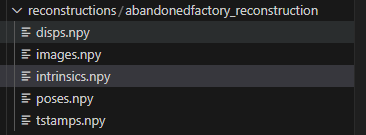
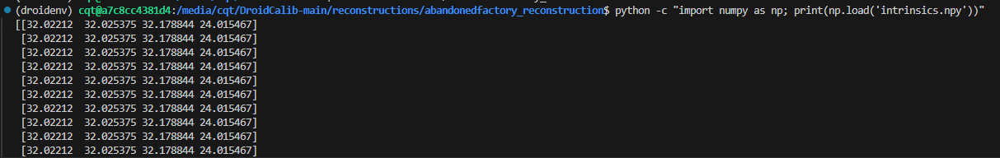
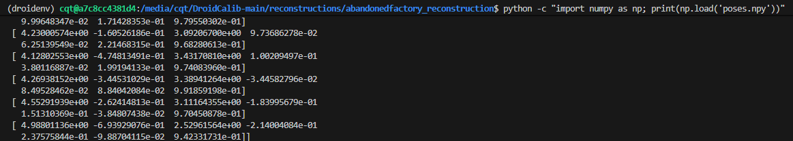
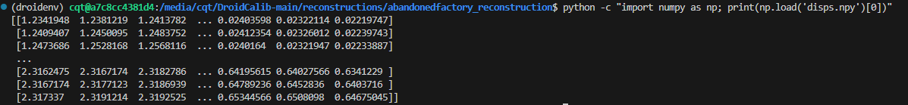
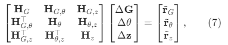
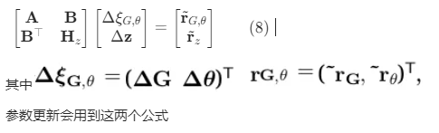
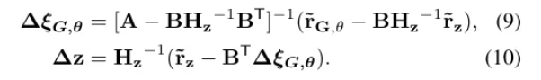

1 引言
---

### **研究问题 (Problem)**

精确的相机内参对于3D感知任务至关重要，但传统的标定方法严重依赖特定的标定物（如棋盘格），过程耗时且无法持续重新标定。现有的自标定方法也存在各自的局限性：

1. **经典多视图方法 (Classical SfM)**：虽然泛化能力强，但通常依赖手工特征，未能充分利用学习特征的强大能力。
2. **纯深度学习方法**：这类方法要么需要为每一个相机单独训练一个模型，要么直接从图像回归内参，但后者的精度被证明有限，并且需要一个包含各种相机的大规模均衡数据集才能实现良好泛化。

因此，核心挑战在于：如何设计一个既能利用深度学习强大的特征提取能力，又能摆脱对特定相机的依赖，实现对未知相机和环境高精度、高效率自标定的方法。

### **解决方案 (Innovation)**

为了解决上述问题，**DroidCalib 提出了一种新颖的深度几何感知相机自标定方法**，其核心是将经典的多视图几何约束与深度学习框架有机结合。

这个方法的主要创新点是引入了一个 **`自标定光束法平差层 (Self-Calibrating Bundle Adjustment Layer, SC-BA layer)`**。

* **解耦学习与几何**：该方法不像其他端到端网络那样尝试去“学习”相机投影的几何原理。它使用深度神经网络（继承自DROID-SLAM）来完成其最擅长的工作：从图像中提取特征并预测像素级的对应关系（光流）和置信度。
* **显式的几何优化**：它将相机内参、相机位姿和场景深度这些几何变量，通过一个可微分的 `SC-BA layer` 进行联合优化。这一层通过经典的、基于重投影误差的高斯-牛顿法来迭代求解最佳的内参，使得优化过程有坚实的几何理论基础。
* **模型泛化能力**：由于投影函数和多视图几何被显式地建模，模型不与任何特定的相机（如针孔或鱼眼）绑定，更换相机模型只需要调整 `SC-BA layer` 中的雅可比矩阵，而不需要重新训练整个深度网络。

通过这种方式，DroidCalib 成功地将深度学习的感知能力与经典BA的几何优化精度结合起来，实现了在未知环境下对单目视频进行高精度的在线自标定。

---
2 论文
---
## 2.1 输入与特征提取

系统接收一段单目图像序列（即一个按时间排序的图像序列）作为输入，并使用卷积神经网络（CNN）将每一帧图像转换为包含高级视觉信息的、尺寸为原始1/8的稠密特征图。

该图像序列被记为：$I = \{I_i\}_{i=0}^{N-1}$
* `N` 是序列中图像的总帧数。
* `I_i` 代表序列中的第 `i` 帧图像。
* 每一帧原始图像，都具有其原始的高度 `H0` 和宽度 `W0`。

#### 初始状态
在处理开始时，系统会对所有需要求解的变量进行一个**初始猜测**，这些变量包括：
* **相机位姿 $G_0^s$**：每一帧相机的位置和姿态。
* **场景深度 $z_0^s$**：每一帧图像中每个像素对应的三维点深度。
* **相机内参 $\theta_0^s$**：定义相机投影模型的核心参数，这是本论文最终要求解的目标。
##### ① 相机位姿初始化
* **文件**: `droid_slam/depth_video.py`
```python
class DepthVideo:
    def __init__(self, N, dim, opt_intr=True, camera_model="pinhole"):
        # 初始化相机位姿 (7参数表示SE3李群)
        self.poses = torch.zeros(N, 7).cuda()  # G0 - 初始位姿
        # 第一个位姿设为单位矩阵
        self.poses[0, 3] = 1.0  # 单位四元数实部
```
##### ② 场景深度初始化
* **文件**: droid_slam/depth_video.py

```python
class DepthVideo:
    def __init__(self, N, dim, opt_intr=True, camera_model="pinhole"):
        # 初始化场景深度 (视差图)
        self.disps = torch.ones(N, *dim).cuda()  # z0 - 初始深度
        # 传感器深度数据（如果有）
        self.disps_sens = torch.zeros(N, *dim).cuda()
```
##### ③相机内参初始化
* **文件**: droid_slam/depth_video.py

```python
class DepthVideo:
    def __init__(self, N, dim, opt_intr=True, camera_model="pinhole"):
        # 初始化相机内参
        self.intrinsics = torch.zeros(N, 4 if camera_model != "mei" else 5).cuda()  # θ0 - 初始内参
        # 所有帧共享相同内参
        self.intrinsics[:] = self.intrinsics[0].repeat(N, 1)
```

一旦接收到图像，系统不会直接在原始像素上操作，而是首先通过一个**卷积神经网络 (CNN)** 将每张图像转换为包含更丰富语义信息的**特征图 (feature map)**。

* **目的**：提取出对后续几何匹配和推理更有帮助的深层视觉特征，而不是简单的颜色或亮度值。
* **网络结构**：该过程由两个并行的卷积神经网络完成，这部分借鉴了其基础架构 DROID-SLAM 的设计：
    1.  **特征网络 (Feature Network)**：主要用于后续计算图像间的相关性。
    2.  **上下文网络 (Context Network)**：提取用于指导后续循环更新过程的上下文信息。
* **输入**：单张图像 $I_i$ (维度: $H0 \times W0 \times 3$)。
* **输出**：两组稠密的特征图。
* **维度**：经过CNN处理后，输出的特征图在空间维度上会被降采样。论文中明确指出，特征图的高度 H 和宽度 W 是原始图像的 1/8。因此，输出特征图的维度为 $(H0/8) \times (W0/8) \times D$，其中 D 是特征通道的数量（例如64或128）。


#### 图像对选择

值得注意的是：
选择图像的**基本单位是图像对**。整个系统的核心操作是针对成对的图像（在图中被标记为 `image_i` 和 `image_j`）进行的。这两张图像分别经过CNN处理后，就得到了用于比较的特征图。

* **选择标准是“视野重叠”**：论文中明确指出，系统输入的图像对 `(i,j)` 的选择标准是它们具有重叠的视场 (**overlapping field-of-view**)。

* **连续帧是常见情况**：在视频中，连续的两帧通常具有最高的视野重叠度，因此它们是最常被选为图像对进行处理的。

* **但是不限于连续帧**：
    1.  在**训练时**，模型会处理由七张图像组成的短序列，这意味着系统可以在这七张图像中形成多个不同的图像对。
    2.  在**实际的SLAM系统运行时**，它会动态构建一个连接所有视野重叠图像的“帧图”。这可能包括相邻的几帧，也可能是在相机回到一个之前经过的区域时（即“回环”），连接两个在时间上相距很远的帧。
    3.  论文的实验部分甚至提到，在处理某些数据集时，他们会“跳过每一帧的下一帧” (`skip every other frame`)，这明确说明了被处理的图像对不是连续的。

## 2.2 相关性计算

通过计算任意两帧图像特征图之间所有特征向量对的内积，构建一个概念上的4D“相关性体积”，它存储了所有像素对之间的视觉相似度分数，为后续匹配提供依据。

### 4D 相关性体积定义

4D 相关性体积是一个四维数据结构，它通过计算两张图像（例如，图像 i 和图像 j）特征图之间所有特征向量对的内积（dot product）来构建。

**构建方式**：通过取图像 i 的特征图和图像 j 的特征图中所有特征向量对的内积来计算。

**维度**：它的维度是 H×W×H×W，其中 H 和 W 分别是特征图的高度和宽度。

**含义**：体积中的每一个元素代表了图像 i 在某个坐标处的特征向量与图像 j 在另一个坐标处的特征向量之间的内积值。这个值可以衡量这两个区域的视觉相似度，高相关性（即内积值大）表明两个图像区域相似，因此它们很可能是对应的区域。

$$
C_{ij} \in \mathbb{R}^{H \times W \times H \times W}
$$

它的每一个元素都是通过特征向量的内积计算得到的。

* **维度**: $H \times W \times H \times W$
    * 前两个维度 ($H \times W$) 索引了 `image i` 特征图中的每一个像素位置 $(u_1, v_1)$。
    * 后两个维度 ($H \times W$) 索引了 `image j` 特征图中的每一个像素位置 $(u_2, v_2)$。
* **含义**: $C_{ij}$ 中坐标为 $(u_1, v_1, u_2, v_2)$ 的那个值，就代表了 `image i` 在 $(u_1, v_1)$ 位置的特征向量与 `image j` 在 $(u_2, v_2)$ 位置的特征向量的相似度分数。

### 按需计算 (On-demand Computation)

这个 4D 体积是极其巨大的。例如，对于降采样后 60×80 的特征图，这个体积的大小是 (60×80)×(60×80) = 4800×4800 ≈ 23,000,000 个浮点数。如果一次性把它全部计算出来并存储在 GPU 显存中，会立刻导致显存溢出。

因此，论文明确指出，系统并**不会预先计算完整的相关性体积**，在后续步骤中，当系统需要知道某个特定区域的相似度时，它才会通过一个**查找算子 (lookup operator L)** 去实时计算相关性体积中对应的那一小部分数值。

## 2.3 迭代更新-预测流动修正量

### 2.3.1 神经网络预测：从理论到修正

在每一次迭代（我们称之为第 k 次迭代）开始时，系统首先要回答一个问题：“如果我当前对内参 $\theta^{k-1}$、位姿 $G^{k-1}$ 和深度 $z^{k-1}$ 的估计是正确的，那么 `image i` 中的像素点 $u_i$ 应该出现在 `image j` 的哪个位置？”

这个问题的答案，就是**理论对应点 $\hat{u}_{ij}$**。

#### ① 计算理论对应点 (理论预测)

* **起点/输入**:
    * **上一次迭代的几何参数**: $(\theta^{k-1}, G^{k-1}, z^{k-1})$
        * **内参 $\theta^{k-1}$**: 一个低维向量，例如对于针孔相机，维度为4 $(f_x, f_y, c_x, c_y)$。
        * **位姿 $G^{k-1}$**: 一系列 SE(3) 矩阵，描述了每帧相机的位置和姿态。
        * **深度 $z^{k-1}$**: 一系列深度图，每张深度图的维度为 $H \times W$。

* **计算过程 (重投影)**: 利用输入的几何参数，通过纯粹的几何投影计算出理论上的像素对应位置 $\hat{u}_{ij}$。
    1.  **逆投影**: 利用内参 $\theta$ 和深度 $z_i$，将 `image i` 上的二维像素点 $u_i$ “还原”成在相机 `i` 坐标系下的三维空间点。
    2.  **坐标变换**: 利用当前的相对位姿 $G_{ij}$，将这个三维点从相机 `i` 的坐标系变换到相机 `j` 的坐标系。
    3.  **再投影**: 再次利用内参 $\theta$，将这个已经变换到相机 `j` 坐标系下的三维点，重新投影回 `image j` 的二维图像平面上，得到一个理论上的二维像素坐标。

* **计算公式**:
    $$
    \hat{u}_{ij} = \pi(G_{ij} \circ \pi^{-1}(u_i, z_i, \theta^{k-1}), \theta^{k-1})
    $$
    * `ui`: `image i` 的像素坐标网格，维度为 H×W×2。
    * `û_ij`: 计算出的 `image j` 上的理论对应点坐标，维度为 H×W×2。


#### ② ConvGRU 模块：进行视觉感知和推理

理论对应点 $\hat{u}_{ij}$ 仅仅是基于上一次几何估计的猜测。现在需要神经网络介入，根据真实的图像内容进行感知和推理，并产出用于优化的目标。

* **输入 (Inputs)**:
    * **相关性特征 (Correlation Features)**: 以理论对应点 $\hat{u}_{ij}$ 为“锚点”，查询第二步生成的4D相关性体积 $C_{ij}$，并结合上下文特征等信息，送入 ConvGRU 模块进行推理。
    * **上下文特征 (Context Features)**: 由一个单独的上下文网络提取的、包含更宏观场景信息的特征图。
    * **当前光流估计 (Current Flow Estimate)**: 由理论对应点 $\hat{u}_{ij}$ 减去原始点 $u_i$ 计算得出的理论像素位移。

* **输出 (Outputs)**:
    ConvGRU 模块处理完输入信息后，会先计算出一个更新后的内部“记忆”（即隐藏状态 $h_{ij}^{k+1}$）。然后，这个隐藏状态会被用来预测以下几个关键的输出：
    * **稠密流动修正量 (Dense Flow Revision, $\Delta u_{ij}$)**: 一个二维向量场，用于修正理论上的对应点位置。
    * **置信度权重 (Confidence Weights, $w_{ij}$)**: 一个权重场，代表了网络对它给出的每一个流动修正量的信心有多大。
    * **像素级阻尼因子 (Pixel-wise Damping Factor, $\lambda$)**: 通过对隐藏状态进行池化操作预测得出的一个参数，用于后续的优化过程。


### 2.3.2 几何优化：构建代价函数

神经网络完成了它的感知和预测任务，现在轮到几何优化部分接手，利用神经网络的输出来更新几何参数。

#### ① 计算测量对应点 (优化的"目标")

这是由**理论预测**和**网络修正**共同构成的、最终的对应点，它被认为是本次优化中应该努力靠近的“正确答案”或“目标真值”。

* **计算公式**:
    $$
    u_{ij}^* = \hat{u}_{ij} + \Delta u_{ij}
    $$
    * $\Delta u_{ij}$ 是 ConvGRU 预测出的流动修正量。
    * $u_{ij}^*$ 是一个稠密的坐标场，维度为 $H \times W \times 2$。

#### ② 构建代价函数 E (总误差)

优化的核心是构建一个代价函数（或总误差）`E`，它的值取决于三个变量：所有相机的位姿 `G`、场景的深度 `z`、以及相机的内参 `θ`。我们的目标就是通过调整这三个变量，来找到使 `E` 最小的值。

这个代价函数衡量的是 **“测量对应点 $u_{ij}^*$”** (目标) 和 **“理论预测 $\pi(...)$”** 之间的加权距离。

* **公式 (Eq. 4)**:
    $$
    E(G, z, \theta) = \sum_{(i,j) \in \mathcal{P}} || u_{ij}^* - \pi(G_{ij} \circ \pi^{-1}(u_i, z_i, \theta), \theta) ||^2_{\Sigma_{ij}}
    $$

* **公式解析**:
    * $u_{ij}^*$: 优化的“目标”，即神经网络预测出的“测量对应点”。
    * $\pi(...)$: 优化的“预测”，即当前几何参数 $(G, z, \theta)$ 推算出的“理论预测”。
    * $|| ... ||^2_{\Sigma_{ij}}$: 计算“目标”和“预测”这两个二维坐标点之间的**加权距离的平方**。
        * **下标 $\Sigma_{ij}$** 代表这个计算是**加权的**。权重来自于神经网络预测的**置信度权重 $w_{ij}$**。
        * 如果神经网络对某个点的预测很有信心 ($w_{ij}$ 很大)，那么这个点的误差在总误差 `E` 中的“惩罚”就越重，优化器会优先去减小这个误差。

该模型将 DROID-SLAM 原本的 DBA 层换成了 SC-BA 优化层，以 $u_{ij}^*$ 为目标，构建一个衡量理论投影与目标之间差距的加权最小二乘代价函数 `E`，并进行严格的数学计算，最终更新几何参数 $(\theta, G, z)$。

### 2.3.3 求解优化问题：通过高斯-牛顿算法求解让代价函数 E 最小的参数更新量。

* **公式 (6):**
    $$
    J^T W J \Delta\xi = J^T W r
    $$

* **维度:**
    * **$\Delta\xi$**: 我们要求解的**参数更新向量**，这是一个维度很长的一维向量，其总维度为 `(相机位姿变量数 × 6) + (内参数量) + (总深度点数量)`。它由以下部分拼接而成：
        $$
        \Delta\xi = (\Delta G, \Delta\theta, \Delta z)^T
        $$
    * **$J$**: 雅可比矩阵，一个巨大的稀疏矩阵。
    * **$r$**: 残差向量，由所有点的二维误差向量堆叠而成。

* **终点/输出:**
    优化站计算出更新量后，输出本次迭代的**最终结果**：
    * **更新后的内参**: $\theta^k = \theta^{k-1} + \Delta\theta$
    * **更新后的位姿**: $G^k = G^{k-1} \oplus \Delta G$ (在李群流形上进行更新)
    * **更新后的深度**: $z^k = z^{k-1} + \Delta z$

* **循环**: 这组更新后的参数 $(\theta^k, G^k, z^k)$ 将作为下一次迭代的起始输入，再次进入流水线的第一站。这个过程不断循环，直至收敛。

SC-BA优化层的目标，就是不断调整相机内参($\theta$)、位姿(G)和场景深度(z)，使得根据这些参数通过几何原理计算出的理论投影点，能够与神经网络给出的、带有高质量置信度的目标对应点 $u_{ij}^*$ 尽可能地重合。所有点的加权误差之和 E 越小，就说明我们估计的这一整套参数越精确。


## 2.4 训练与损失函数

在训练阶段，系统会计算最终估计内参与真实内参之间的损失。由于整个流程（包括SC-BA层）是完全可微分的，这个损失可以反向传播来更新神经网络的参数，从而“教会”网络如何预测出最有利于几何求解的对应关系。

DroidCalib 的设计精髓就在于，从输入图像到最终输出内参的**整个流程都是可微分的 (differentiable)**。这意味着，即使是 SC-BA 层这样复杂的几何优化过程，也被设计成了在数学上可以求导的模块。

在DROID-SLAM中，有如下：
1. 测地线损失 (Geodesic Loss)
2. 残差损失 (Residual Loss)
3. 光流损失 (Flow Loss)

这些损失函数主要用于系统的训练阶段，帮助神经网络学习更好的特征表示和运动估计，而不是在实际SLAM运行时使用。在运行时，系统使用的是Bundle Adjustment优化（公式6-10），直接最小化重投影误差。

**在Droid-calib中，额外添加了内参损失函数**

### 2.4.1 内参损失函数 ($L_{\theta}$)

* **输入**:
    * 每一次迭代中 SC-BA 层输出的内参估计值: $\hat{\theta}^k$
    * 数据集中提供的真实内参 (Ground Truth): $\bar{\theta}$

* **核心公式**:
    论文中明确给出了额外添加的内参损失的计算公式：
    $$
    L_{\theta} = \sum_{k=1}^{n_k} \gamma^{n_k-k} ||\hat{\theta}^k - \bar{\theta}||_1
    $$

* **公式含义与维度分解**:
    * **$L_{\theta}$**: 最终计算出的**内参损失值**。这是一个**1维的标量**，代表了本次预测的总误差。
    * **$\sum_{k=1}^{n_k}$**: 对**每一次迭代**的结果都计算一次损失，然后累加。这意味着在一次7帧序列的处理中（共14次迭代），网络会收到14次关于其表现的“反馈”，这是一种非常密集的监督方式。
    * **$\hat{\theta}^k$ 和 $\bar{\theta}$**: 分别是第 `k` 次迭代的估计内参与真实内参。它们都是低维向量（例如4维），所以 $||\cdot||_1$ 计算的是它们之间的**L1范数**（各项绝对差之和），结果是一个1维的标量。
    * **$\gamma^{n_k-k}$**: **权重因子**。$\gamma$ 是一个小于1的常数（如0.9）。这个项的巧妙之处在于，随着迭代次数 `k` 的增加（越来越接近最终结果），指数 $n_k-k$ 会变小，导致整个权重项变大。这意味着，**系统更关心后期迭代的准确性**，因为后期的估计是基于更充分优化的结果，理应更接近真值。

### 2.4.2 学习过程：反向传播

1.  在一次前向传播（即完整执行一遍第一到第三步）后，系统计算出总的损失值（包括 $L_{\theta}$ 和其他损失）。
2.  然后，这个损失值的梯度会沿着整个计算图**反向传播**。
3.  梯度会一直传到流水线的起点——**神经网络**，并告诉网络中的每一个参数（权重）应该如何微调，才能在下一次看到类似输入时，做出能产生更小损失的预测。


### 2.4.3 **核心逻辑**

这部分的核心逻辑是解释**系统如何通过一个精心设计的损失函数，将最终的几何精度误差反向传递，从而“教会”前端的神经网络如何更好地预测对应关系**。

1.  **前提：端到端可微分**：整个 DroidCalib 的流程，从输入图像到最终输出内参，虽然包含了复杂的几何优化（SC-BA层），但从数学上被设计成一个完全可微分的模块。这是实现端到端训练的基础。
2.  **计算内参损失**：在一次完整的前向传播（包含多次内部迭代）后，系统会计算一个**内参损失值 ($L_{\theta}$)**。这个损失函数会比较**每一次迭代**输出的内参 $\hat{\theta}^k$ 和数据集提供的真实内参 $\bar{\theta}$ 之间的L1距离。
3.  **加权反馈机制**：该损失函数有一个关键的权重因子 $\gamma^{n_k-k}$。它会让**越靠后的迭代**产生的误差在总损失中占据**越大的比重**。这是因为后期的估计是基于更充分优化的结果，理论上应该更接近真值，所以系统更关心后期估计的准确性。
4.  **反向传播与学习**：计算出的总损失值的梯度会沿着整个计算图**反向传播**，一直传到流水线的起点——**神经网络**。这个梯度会指导网络中的每一个参数（权重）进行微调，让网络在下一次处理类似输入时，能够产生更高质量的预测（光流修正和置信度），从而使得SC-BA层能计算出更精确的内参，最终降低损失值。

## 2.5 输出

在推理阶段（即模型训练完成后），系统执行前面的流程。当迭代循环结束后，系统最终输出三份结果：精确的相机内参、准确的相机轨迹（位姿）(可选)以及稠密的三维场景地图（深度）(可选)。

### 核心目标

* 在不依赖任何标定物和相机先验知识的情况下，从一段普通的单目视频中，**精确地恢复出相机自身的内参**，并能泛化到不同的相机模型（如鱼眼镜头）。

### 输入 (Inputs)

#### 1. 主要输入：

* 一段单目视频（即一个按时间排序的图像序列）。

#### 2. 初始状态 (Initial Guess)：

* 对所有待求解参数的一个**初始猜测值**，即使这个猜测非常粗略或不准确。这包括：
    * 相机内参 ($\theta^0$)
    * 相机位姿 ($G^0$)
    * 场景深度 ($z^0$)


系统在一个统一的优化框架下，同时求解以下三组核心参数：

1.  **相机内参 ($\theta$)**: 这是系统的**核心求解目标**，可能包括：
    * 焦距 ($f_x, f_y$)
    * 主点坐标 ($c_x, c_y$)
    * 畸变参数 (例如统一相机模型中的 $\alpha$)
2.  **相机位姿 ($G$)**: 描述相机在每一帧的空间位置和姿态（即相机轨迹）。
3.  **场景深度 ($z$)**: 描述场景的三维结构，通常以稠密深度图的形式存在。

### 最终输出 (Final Outputs)

当系统处理完视频并完成所有迭代循环后，最终输出以下结果：

1.  相机内参 ($\hat{\theta}$)。
2.  相机轨迹 ($\hat{G}$) (可选)。
3.  深度 ($\hat{z}$) (可选)。
---
项目代码
---
**源码链接**：https://github.com/boschresearch/DroidCalib

## 3.1创建环境
```python
conda create -n droidenv python=3.10 -y
conda activate droidenv
```
```python
conda env create -f environment_novis.yaml #安装环境包
```
```python
pip install torch==2.1.0+cu118 \
            torchvision==0.16.1+cu118 \
            torchaudio==2.1.1+cu118 \
            --index-url https://download.pytorch.org/whl/cu118 #安装正确版本的pytorch
```
安装PyTorch Geometric (PyG)
```python 
pip install torch-scatter -f https://data.pyg.org/whl/torch-2.1.0+cu118.html
pip install torch-sparse -f https://data.pyg.org/whl/torch-2.1.0+cu118.html
pip install torch-cluster -f https://data.pyg.org/whl/torch-2.1.0+cu118.html
pip install torch-spline-conv -f https://data.pyg.org/whl/torch-2.1.0+cu118.html
pip install torch-geometric -f https://data.pyg.org/whl/torch-2.1.0+cu118.html
```
```python 
python setup.py install #执行安装程序
```
```python 
python demo.py --imagedir=datasets/demo/abandonedfactory --opt_intr --num_images=300 #进行测试
```

## 3.2 测试结果

```python 
150it [00:58,  2.55it/s]
################################
Global BA Iteration #1
Global BA Iteration #2
Global BA Iteration #3
Global BA Iteration #4
Global BA Iteration #5
Global BA Iteration #6
Global BA Iteration #7
################################
Global BA Iteration #1
Global BA Iteration #2
Global BA Iteration #3
Global BA Iteration #4
Global BA Iteration #5
Global BA Iteration #6
Global BA Iteration #7
Global BA Iteration #8
Global BA Iteration #9
Global BA Iteration #10
Global BA Iteration #11
Global BA Iteration #12
################################
Initial intrinsics:
fx = 560.0, fy = 560.0, ppx = 320.0, ppy = 240.0
Estimated intrinsics:
fx = 321.03, fy = 320.83, ppx = 321.50, ppy = 241.05
```

初始内参 (Initial intrinsics):
```python 
fx = 560.0, fy = 560.0, ppx = 320.0, ppy = 240.0
```
这是一个非常粗略的初始猜测值。如果没有提供标定文件，默认的内部参数计算为：
```python 
fx = fy = (w0 + h0) / 2
cx = w0 / 2  #ppx
cy = h0 / 2  #ppy
```
估算内参 (Estimated intrinsics):
```python 
fx = 321.03, fy = 320.83, ppx = 321.50, ppy = 241.05
```
这是经过前面所有处理和两轮全局BA优化后，系统最终得出的精确结果。

如图 经过单目图片序列不断优化处理，系统最终得到精确的内参。


以下是可选的相机轨迹和深度的输出

内参

位姿

深度
 只输出了第一帧的

## 3.3 论文公式对应代码
$$
\pi(\mathbf{x}, \theta) = \begin{bmatrix} f_x \frac{x}{z} + c_x \\ f_y \frac{y}{z} + c_y \end{bmatrix}, \quad \pi^{-1}(\mathbf{u}, z, \theta) = z \begin{bmatrix} \frac{p_x - c_x}{f_x} \\ \frac{p_y - c_y}{f_y} \\ 1 \end{bmatrix} \quad (1)
$$
在 `droid_slam/geom/projective_ops.py` 中 101-128行的`proj`函数已经实现了正向投影和反向投影（python版本）。

### 正向投影（👈）代码实现

```python
def proj(Xs, intrinsics, jacobian=False, return_depth=False):
    
    # 从内参张量 intrinsics (对应论文公式中的 θ) 中提取焦距 (fx, fy) 和主点 (cx, cy)。
    fx, fy, cx, cy = extract_intrinsics(intrinsics)

    # 从输入的 M 维点张量 Xs (对应论文公式中的三维点 x) 中分解出 X, Y, Z 坐标和齐次坐标 d (通常为1)。
    X, Y, Z, d = Xs.unbind(dim=-1)

    # 这是一个数值稳定性保护措施。如果深度 Z 过小，为避免除以一个极小的数导致计算错误，
    # 将小于 0.5*MIN_DEPTH 的 Z 值替换为 1.0
    Z = torch.where(Z < 0.5*MIN_DEPTH, torch.ones_like(Z), Z)
    # 计算逆深度 d = 1 / Z。这是一个常见的计算技巧，将后续的除法操作转换为乘法，可以提高效率。
    d = 1.0 / Z

    # 计算 x 像素坐标，对应公式的第一行: fx * (X / Z) + cx
    x = fx * (X * d) + cx
    # 计算 y 像素坐标，对应公式的第二行: fy * (Y / Z) + cy
    y = fy * (Y * d) + cy

    # 根据参数决定是否在返回的坐标中额外包含深度信息。
    if return_depth:
        # 如果需要，将 x, y 和投影后的逆深度 d (D*d) 堆叠起来作为输出。
        coords = torch.stack([x, y, D*d], dim=-1)
    else:
        # 默认情况下，只堆叠二维像素坐标 (x, y)。
        coords = torch.stack([x, y], dim=-1)
    
    # 如果 jacobian 参数为 True, 则计算投影函数对于输入三维点坐标 (X, Y, Z, D) 的偏导数矩阵。
    # 这个矩阵在基于优化的方法（如高斯-牛顿法）中是必需的。
    if jacobian:
        # 获取输入的维度信息。
        B, N, H, W = d.shape
        # 创建一个与 d 形状相同的零张量，用于填充雅可比矩阵中的零项。
        o = torch.zeros_like(d)

        # 构建雅可比矩阵。矩阵的每一项都是投影坐标 (x, y) 对输入 (X, Y, Z, D) 的偏导数。
        # 导数计算如下:
        # ∂x/∂X = fx*d
        # ∂x/∂Z = -fx*X*d*d
        # 其他偏导数项 (如 ∂x/∂Y, ∂y/∂X 等) 均为 0。
        proj_jac = torch.stack([
            fx*d,    o, -fx*X*d*d, o,
               o, fy*d, -fy*Y*d*d, o,
        ], dim=-1).view(B, N, H, W, 2, 4)

        # 返回投影坐标和计算出的雅可比矩阵。
        return coords, proj_jac
        
    # 如果不需要雅可比矩阵，则第二个返回值为 None。
    return coords, None
```

### 反向投影（👉）代码实现
在 droid_slam/geom/projective_ops.py 文件中，iproj 函数实现了反向投影：（25-99）
```python
def iproj(disps, intrinsics, jacobian=False):
    # 获取视差图的高度和宽度
    ht, wd = disps.shape[2:]
    
    # 提取相机内参：fx(焦距x), fy(焦距y), cx(主点x), cy(主点y)
    fx, fy, cx, cy = extract_intrinsics(intrinsics)
    
    # 创建像素坐标网格
    # y: 垂直方向坐标，从0到ht-1
    # x: 水平方向坐标，从0到wd-1
    y, x = torch.meshgrid(
        torch.arange(ht).to(disps.device).float(),
        torch.arange(wd).to(disps.device).float())

    # 创建齐次坐标的第三分量，初始化为1
    # 在齐次坐标中，(x, y, 1)表示图像平面上的点
    i = torch.ones_like(disps)
    
    # 执行反向投影计算：
    # 1. 将像素坐标转换为中心化坐标: (x-cx), (y-cy)
    # 2. 除以焦距进行归一化: (x-cx)/fx, (y-cy)/fy
    # 这样得到的是在归一化相机坐标系中，深度为1时的3D点坐标
    X = (x - cx) / fx  # 归一化X坐标
    Y = (y - cy) / fy  # 归一化Y坐标
    
    # 将X, Y, Z(=1), 以及原始视差值组合成4维点坐标
    # pts的形状为 [B, N, H, W, 4]
    pts = torch.stack([X, Y, i, disps], dim=-1)

    # 如果需要计算雅可比矩阵（用于优化过程中的梯度计算）
    if jacobian:
        # 初始化雅可比矩阵，与pts形状相同
        J = torch.zeros_like(pts)
        # 对于视差分量，其导数为1（因为输出直接等于输入）
        J[...,-1] = 1.0
        return pts, J

    # 返回3D点坐标和空的雅可比矩阵
    return pts, None

```
第二个公式
$$
\pi(\mathbf{x}, \theta) = \begin{bmatrix} f_x \frac{x}{z + \alpha ||\mathbf{x}||} + c_x \\ f_y \frac{y}{z + \alpha ||\mathbf{x}||} + c_y \end{bmatrix}, \quad (2)
$$
这个公式描述的是 **Mei 相机模型（Unified Camera Model）** 的投影过程。其中：

- `x, y, z` 是 3D 点在相机坐标系中的坐标
- `fx, fy` 是焦距参数
- `cx, cy` 是主点坐标
- `α` 是畸变参数（在代码中对应变量 `xi`）

该模型用于处理 **具有强烈径向畸变的镜头，例如鱼眼镜头**。

在 `droid_slam/geom/projective_ops.py` 文件中：

- `proj_mei` 函数实现了 **正向投影（3D 点 → 2D 像素）**
```python
def proj_mei(Xs, intr, jacobian=False, return_depth=False):
    """Mei相机模型的投影函数
    将3D点从相机坐标系投影到图像平面坐标
    
    使用Mei相机模型（统一相机模型）进行投影变换，该模型可以同时处理针孔相机和鱼眼相机。
    投影过程考虑了径向畸变的影响，通过参数xi控制畸变程度。
    
    投影数学公式:
    给定3D点(X, Y, Z)和相机内参(fx, fy, cx, cy, xi)，计算其在图像上的投影坐标:
    1. 计算点到光心的距离: r = sqrt(X² + Y² + Z²)
    2. 计算缩放因子: factor = 1 / (Z + xi * r)
    3. 计算归一化图像坐标: xn = X * factor, yn = Y * factor
    4. 转换到像素坐标: x = fx * xn + cx, y = fy * yn + cy
    
    参数:
        Xs: 3D点坐标，形状为[B, N, H, W, 4]，其中:
            B - 批处理大小
            N - 帧数
            H - 图像高度
            W - 图像宽度
            4个分量分别对应[X, Y, Z, D]，其中D是原始视差值
        intr: 相机内参，形状为[B, N, 5]，5个参数为[fx, fy, cx, cy, xi]:
            fx, fy - x和y方向的焦距
            cx, cy - 主点（光学中心）坐标
            xi - Mei相机模型的畸变参数
        jacobian: 是否计算雅可比矩阵，默认为False
                  注意：当前实现不支持雅可比矩阵计算
        return_depth: 是否返回深度信息，默认为False
                      若为True则返回[x, y, depth]，否则仅返回[x, y]
                      
    返回:
        coords: 投影后的像素坐标，形状取决于return_depth参数:
                若return_depth=True: [B, N, H, W, 3] ([x, y, depth])
                若return_depth=False: [B, N, H, W, 2] ([x, y])
        None: 占位符，与其它投影函数接口保持一致
        None: 占位符，与其它投影函数接口保持一致
        
    异常:
        Exception: 当jacobian=True时抛出，因为当前未实现雅可比矩阵计算
    """
    # 提取相机内参：fx(焦距x), fy(焦距y), cx(主点x), cy(主点y), xi(Mei畸变参数)
    fx, fy, cx, cy, xi = extract_intrinsics(intr)
    # 分解3D点坐标为X, Y, Z分量和视差值D
    X, Y, Z, D = Xs.unbind(dim=-1)

    # 处理过小的深度值，避免数值不稳定
    Z = torch.where(Z < 0.5*MIN_DEPTH, torch.ones_like(Z), Z)

    # 计算深度的倒数
    d = 1.0 / Z
    # 计算3D点到光心的距离
    r = torch.sqrt(X**2 + Y**2 + Z**2)
    # 计算Mei投影的缩放因子
    factor = 1.0 / (Z + xi * r)

    # 执行Mei相机模型投影计算
    x = fx * (X * factor) + cx
    y = fy * (Y * factor) + cy

    # 根据return_depth参数决定是否包含深度信息
    if return_depth:
        coords = torch.stack([x, y, D*d], dim=-1)
    else:
        coords = torch.stack([x, y], dim=-1)

    # 当前版本不支持雅可比矩阵计算
    if jacobian:
        raise Exception("Jacobian for mei model currently not supported.")

    return coords, None, None
```

核心计算过程如下：

1. **计算 3D 点到相机原点的距离**
r = sqrt(X² + Y² + Z²)
2. **计算投影因子**
factor = 1.0 / (Z + xi * r)
3. **应用 Mei 模型投影公式**
x = fx * (X * factor) + cx
y = fy * (Y * factor) + cy


其中，公式中的 `α‖x‖` 对应于代码中的 `xi * r`。

* iproj_mei 函数实现了反向投影（2D像素到3D）
```python
  def iproj_mei(disps, intr, jacobian=False):
    """Mei相机模型的逆投影函数
    将图像平面上的像素坐标和视差值转换为Mei鱼眼相机模型下的3D点坐标
    
    该函数实现了Mei鱼眼相机模型的逆投影过程，根据内参将像素坐标和视差值映射到三维空间坐标。
    
    Args:
        disps: 视差图，形状为[..., H, W]的张量，其中H为高度，W为宽度
        intr: 相机内参，包含fx, fy, cx, cy, xi参数，形状为[..., 5]
        jacobian: 是否计算雅可比矩阵，默认为False
        
    Returns:
        tuple: 包含以下元素的元组:
            - pts: 逆投影后的齐次坐标点，形状为[..., H, W, 4]
            - None: 保留位置（用于雅可比矩阵）
            - None: 保留位置（用于其他输出）
            
    Raises:
        Exception: 当jacobian=True时抛出异常，因为当前不支持Mei模型的雅可比矩阵计算
    """
    # 获取视差图的高度和宽度
    ht, wd = disps.shape[2:]
    fx, fy, cx, cy, xi = extract_intrinsics(intr)
    
    # 生成像素坐标的网格
    y, x = torch.meshgrid(
        torch.arange(ht).to(disps.device).float(),
        torch.arange(wd).to(disps.device).float())

    # 计算中间变量rhat和factor
    rhat = ((x - cx) / fx)**2 + ((y - cy) / fy)**2
    factor = (xi + torch.sqrt(1 + (1 - xi**2) * rhat)) / (1 + rhat)

    # 计算三维点在相机坐标系下的坐标
    X = (x - cx) * factor / fx
    Y = (y - cy) * factor / fy
    Z = factor - xi

    # 构造齐次坐标形式的3D点，并附加视差值
    pts = torch.stack([X/Z, Y/Z, Z/Z, disps], dim=-1)

    if jacobian:
        raise Exception("Jacobian for mei model currently not supported.")

    return pts, None, None
```

iproj 和 iproj_mei 函数之间的主要区别在于它们使用的相机模型不同：
* iproj: 使用4个内参 [fx, fy, cx, cy]（x和y方向焦距、主点坐标）
* iproj_mei: 使用5个内参 [fx, fy, cx, cy, xi]，额外的 xi 是Mei模型的畸变参数

在投影计算上也有所不同：
* iproj: 使用线性变换，计算简单直观：
```
X = (x - cx) / fx
Y = (y - cy) / fy
Z = 1
```
* iproj_mei: 使用更复杂的非线性变换来处理鱼眼镜头的畸变：
```
rhat = ((x - cx) / fx)**2 + ((y - cy) / fy)**2
factor = (xi + torch.sqrt(1 + (1 - xi**2) * rhat)) / (1 + rhat)
X = (x - cx) * factor / fx
Y = (y - cy) * factor / fy
Z = factor - xi
```
在CUDA代码中， 统一相机模型的投影变换实现如下：droid_kernels.cu第210行的函数
```python
proj_transform_mei(const float* uvi, const float* qij, const float* tij, 
        const float fx, const float fy, const float cx, const float cy, 
        const float xi, const float disp, float* uvj) {
    /* Mei鱼眼相机模型的投影变换函数
     * 实现从相机i到相机j的投影变换，包括逆投影、坐标变换和再投影过程
     *
     * 参数说明:
     * uvi: 相机i中的像素坐标 (u, v)
     * qij: 从相机i到相机j的旋转四元数 (qx, qy, qz, qw)
     * tij: 从相机i到相机j的平移向量 (tx, ty, tz)
     * fx, fy: 相机内参 - x,y方向焦距
     * cx, cy: 相机内参 - 主点坐标
     * xi: Mei模型畸变参数
     * disp: 视差值
     * uvj: 输出 - 相机j中的像素坐标 (u, v)
     */

    // 第一步：将像素坐标转换为归一化坐标（逆投影的第一步）
    const float xs = (uvi[0] - cx) / fx;
    const float ys = (uvi[1] - cy) / fy;
    
    // 第二步：计算Mei模型的逆投影因子β
    // 公式: β = (ξ + √(1 + (1 - ξ²)(xs² + ys²))) / (1 + xs² + ys²)
    const float beta = (xi + sqrt( 1 + ( 1 - xi * xi) * (xs * xs  + ys * ys))) 
                       / (1 + xs * xs  + ys * ys);

    // 第三步：根据β和畸变参数ξ重建三维点坐标（逆投影的完成）
    float Xi[4];
    float Xj[4];
    Xi[0] = beta * xs / (beta - xi);  // X坐标
    Xi[1] = beta * ys / (beta - xi);  // Y坐标
    Xi[2] = 1.0;                      // Z坐标设为1（归一化深度）
    Xi[3] = disp;                     // 保存视差值

    // 第四步：应用SE(3)变换将点从相机i坐标系变换到相机j坐标系
    // 包括旋转(qij)和平移(tij)变换

    actSE3(tij, qij, Xi, Xj);

    // 第五步：将变换后的3D点投影回相机j的图像平面
    // 深度保护机制：防止除零错误和无效投影
    const float d = (Xj[2] < MIN_DEPTH) ? 0.0 : 1.0 / Xj[2];
    const float z = (Xj[2] < MIN_DEPTH) ? 0.0 : Xj[2];
    
    // 计算三维点到原点的距离
    const float r = sqrt(Xj[0] * Xj[0] + Xj[1] * Xj[1] + z * z);
    
    // 计算Mei模型的正向投影因子
    // 公式: mei_factor = 1 / (Z + ξ*r)
    const float mei_factor = ((z + xi * r) < MIN_DEPTH) ? 0.0 : 1.0 / (z + xi * r);

    // 最终投影：计算在相机j图像平面上的像素坐标
    uvj[0] = fx * Xj[0] * mei_factor + cx;  // u坐标
    uvj[1] = fy * Xj[1] * mei_factor + cy;  // v坐标
}
```
在general_projective_transform函数中根据model_id选择相应的投影函数：
```python
def general_projective_transform(poses, depths, intr, ii, jj, jacobian=False, 
                                 return_depth=False, model_id=0):
    
    if (model_id == 0) or (model_id == 2): # pinhole or focal
        return projective_transform(poses, depths, intr, ii, jj, jacobian, return_depth)
    
    elif model_id == 1: # mei
        return projective_transform_mei(poses, depths, intr, ii, jj, jacobian, return_depth)
```
公式3
$$
\mathbf{u}_{jl} = \pi(\mathbf{G}_{ij} \circ \pi^{-1}(\mathbf{u}_{il}, z_{il}, \theta), \theta),
\tag{3}
$$
这个公式描述了从相机i中的像素点到相机j中对应像素点的投影变换过程，ujℓ 是在相机j的图像平面上，由相机i中的像素点 uiℓ 对应的3D点投影而来的预测像素坐标。
● uiℓ：相机i中的像素坐标（2D）
● ziℓ：相机i中像素点的深度值
● θ：相机内参（包括 fx, fy, cx, cy, xi 等）
● π⁻¹：逆投影函数，将2D像素坐标和深度值转换为3D点
● Gij：刚体变换（SE3），将点从相机i坐标系变换到相机j坐标系
● π：正向投影函数，将3D点投影到图像平面
● ujℓ：相机j中的对应像素坐标（2D）

### 1. 逆投影过程 π⁻¹(uiℓ, ziℓ, θ)
如果model值为1，也就是选择了统一相机模型（mei）
则逆投影过程为src/droid_kernels.cu的proj_transform_mei函数（219-237）
```python
// 第一步：将像素坐标转换为归一化坐标（逆投影的第一步）
const float xs = (uvi[0] - cx) / fx;
const float ys = (uvi[1] - cy) / fy;

// 第二步：计算Mei模型的逆投影因子β
// 公式: β = (ξ + √(1 + (1 - ξ²)(xs² + ys²))) / (1 + xs² + ys²)
const float beta = (xi + sqrt( 1 + ( 1 - xi * xi) * (xs * xs  + ys * ys))) 
                   / (1 + xs * xs  + ys * ys);

// 第三步：根据β和畸变参数ξ重建三维点坐标（逆投影的完成）
float Xi[4];
Xi[0] = beta * xs / (beta - xi);  // X坐标
Xi[1] = beta * ys / (beta - xi);  // Y坐标
Xi[2] = 1.0;                      // Z坐标设为1（归一化深度）
Xi[3] = disp;                     // 保存视差值
● uvi[0] 和 uvi[1]：输入的像素坐标 u 和 v
● cx, cy：相机主点坐标（图像中心点）
● fx, fy：相机焦距参数
● xi：Mei模型畸变参数
● xs, ys：归一化图像平面坐标
● beta：Mei模型的逆投影因子
● Xi[4]：逆投影后的齐次3D点坐标 [X, Y, Z, disparity]
```

* 如果model的值是0或者2 也就是针孔和焦距模型。则其逆投影公式如上面公式1所示的代码一样。

### 2. 坐标系变换 Gij
```python
float Xj[4];
actSE3(tij, qij, Xi, Xj);
```
● tij[3]：从相机i到相机j的平移向量 [tx, ty, tz]
● qij[4]：从相机i到相机j的旋转四元数 [qx, qy, qz, qw]
● Xi[4]：相机i坐标系中的3D点
● Xj[4]：变换到相机j坐标系中的3D点
这段代码包括了平移和旋转 从相机i经过刚体变换到相机j

### 3. 正向投影过程 π(..., θ)
根据前述的正向投影公式进行正向投影

公式4
$$
E(\mathbf{G}, \mathbf{z}, \theta) = \sum_{(i,j)\in\mathcal{P}} \|\underbrace{\mathbf{u}_{ij}^* - \pi(\mathbf{G}_{ij} \circ \pi^{-1}(\mathbf{u}_i, z_i, \theta), \theta)}_{\mathbf{r}_{ij}}\|^2_{\Sigma_{ij}},
\tag{4}
$$
● E(G,z,θ)：重投影误差函数（代价函数）
● (i,j)∈P：所有图像对的集合，P表示所有参与优化的图像对
● u*ij：在图像j中观测到的图像i特征点的对应点坐标（观测值）
● π(Gij ◦ π⁻¹(ui,zi,θ),θ)：根据公式(3)计算出的预测点坐标
● rij：鲁棒核函数（robust kernel function），用于减少异常值的影响
● Σij：协方差矩阵，用于加权误差计算
● ||.||²_Σij：马氏距离（Mahalanobis distance），考虑了协方差的加权距离

公式4其中的部分已在刚刚公式3中提出，其中uij是预测像素坐标，而公式4里的u*ij是对应的观测值。

### 1. 残差计算（公式核心部分：u*ij − π(Gij ◦ π⁻¹(ui,zi,θ),θ)）
python端中，在droid_slam/geom/ba.py的42行中
```python
r = (target - coords).view(B, N, -1, 1)
```
直接计算它们的差值，coords是直接调用了前面的计算预测值uij的公式代码。
```python
    coords, valid, (Ji, Jj, Jz) = pops.projective_transform(
        poses, disps, intrinsics, ii, jj, jacobian=True)
```
```python
def projective_transform(poses, depths, intrinsics, ii, jj, jacobian=False, return_depth=False):
    """ map points from ii->jj """

    # inverse project (pinhole)
    X0, Jz = iproj(depths[:,ii], intrinsics[:,ii], jacobian=jacobian)
    
    # transform
    Gij = poses[:,jj] * poses[:,ii].inv()

    Gij.data[:,ii==jj] = torch.as_tensor([-0.1, 0.0, 0.0, 0.0, 0.0, 0.0, 1.0], device="cuda")
    X1, Ja = actp(Gij, X0, jacobian=jacobian)
    
    # project (pinhole)
    x1, Jp = proj(X1, intrinsics[:,jj], jacobian=jacobian, return_depth=return_depth)

    # ...
    return x1, valid
```
● iproj：执行逆投影，将图像点和深度值转换为3D点
● poses[:,jj] * poses[:,ii].inv()：计算从图像i到图像j的变换矩阵Gij
● actp(Gij, X0, jacobian=jacobian)：应用变换矩阵将3D点从相机i坐标系转换到相机j坐标系
● proj：将变换后的3D点投影到相机j的图像平面上

同样的，对于mei模型 也有对应的函数进行可以进行相同的变换

```python
def projective_transform_mei(poses, depths, intr, ii, jj, jacobian=False, return_depth=False):

    """ map points from ii->jj """
    if torch.sum(torch.isnan(depths))>0:
        raise Exception('nan values in depth')
    
    # inverse project
    X0, _, _ = iproj_mei(depths[:,ii], intr[:,ii], jacobian=jacobian)

    # transform 计算从相机i到相机j的变换矩阵
    Gij = poses[:,jj] * poses[:,ii].inv()
    # 特殊处理当源图像和目标图像相同时的情况（即ii==jj）
    Gij.data[:,ii==jj] = torch.as_tensor([-0.1, 0.0, 0.0, 0.0, 0.0, 
                                            0.0, 1.0], device="cuda")
    #[-0.1, 0.0, 0.0, 0.0, 0.0, 0.0, 1.0]：这是一个特殊的SE(3)李群参数
前3个值[-0.1, 0.0, 0.0]：平移向量(tx, ty, tz) 理论上应该是无平移 但是设置了一个-0.1 小的位移 不懂为啥
后4个值[0.0, 0.0, 0.0, 1.0]：单位四元数(0, 0, 0, 1)，表示无旋转
                                          
    X1, _ = actp(Gij, X0, jacobian=jacobian)
    
    # project 
    x1, _, _ = proj_mei(X1, intr[:,jj], jacobian=jacobian, 
                                return_depth=return_depth)

    # exclude points too close to camera
    valid = ((X1[...,2] > MIN_DEPTH) & (X0[...,2] > MIN_DEPTH)).float()
    valid = valid.unsqueeze(-1) #增加一个维度

    ·X0[...,2]：X0是逆投影后的3D点，[...,2]表示取Z坐标（深度）
    ·X1[...,2]：X1是坐标变换后的3D点，[...,2]表示取Z坐标（深度）
    ·MIN_DEPTH：最小深度阈值，常量定义为0.2
    ·X0[...,2] > MIN_DEPTH：检查变换前的点是否距离相机足够远
    ·X1[...,2] > MIN_DEPTH：检查变换后的点是否距离相机足够远
    ·.float()：将布尔值转换为浮点数（True→1.0, False→0.0）
    ·作用就是排除一些距离太近的点
    理由：
    ·数值稳定性：当点非常接近相机时（Z接近0），在投影计算中会出现除零或数值不稳定
     物理合理性：实际场景中，相机不可能观测到距离自己非常近的点
     避免奇异情况：防止在后续计算中出现无穷大或NaN值
    


    

    if jacobian:
        raise Exception("Jacobian for mei model currently not supported.")

    return x1, valid

```

target的值首先经过factor_graph.py 文件中的初始化（124）
```python
# 在因子图中添加新的因子时，计算target值
# target表示当前状态下，将图像ii中的点投影到图像jj中的坐标
with torch.cuda.amp.autocast(enabled=False):
    # 调用video的reproject函数计算target
    # 这里计算的是基于当前位姿估计的投影结果
    target, _ = self.video.reproject(ii, jj)
    # 初始化权重为0，后续会根据残差动态调整
    weight = torch.zeros_like(target)

# 将新的图像对索引添加到因子图中
self.ii = torch.cat([self.ii, ii], 0)
self.jj = torch.cat([self.jj, jj], 0)
# 初始化因子的年龄为0
self.age = torch.cat([self.age, torch.zeros_like(ii)], 0)

# reprojection factors
# 添加网络相关数据
self.net = net if self.net is None else torch.cat([self.net, net], 1)

# 将计算得到的target和weight添加到因子图中
self.target = torch.cat([self.target, target], 1)
self.weight = torch.cat([self.weight, weight], 1)
```
这个函数又调用depth_video.py 文件中的 reproject 函数（第163行）
```python
def reproject(self, ii, jj):
    """ project points from ii -> jj 
    将图像ii中的点投影到图像jj中
    
    参数:
        ii: 源图像索引
        jj: 目标图像索引
        
    返回:
        coords: 投影后的坐标
        valid_mask: 有效点的掩码
    """
    # 格式化索引
    ii, jj = DepthVideo.format_indicies(ii, jj)
    # 将位姿转换为李群SE3格式
    Gs = lietorch.SE3(self.poses[None])

    # 调用投影变换函数进行投影计算
    # 输入参数包括:
    # - Gs: 所有图像的位姿
    # - self.disps[None]: 所有图像的视差图
    # - self.intrinsics[None]: 所有图像的内参
    # - ii, jj: 源图像和目标图像索引
    # - model_id: 相机模型ID
    coords, valid_mask = \
        pops.general_projective_transform(Gs, self.disps[None], self.intrinsics[None], 
                                          ii, jj, model_id=self.model_id)

    return coords, valid_mask

```
然后再调用general_projective_transform函数 在projective_ops.py 文件里
```python
def general_projective_transform(poses, depths, intr, ii, jj, jacobian=False, 
                                 return_depth=False, model_id=0):
    """
    通用投影变换函数，根据相机模型ID选择相应的投影变换实现
    
    该函数实现了公式(3) ujℓ = π(Gij ◦ π⁻¹(uiℓ, ziℓ, θ), θ) 的计算过程
    即：将图像ii中的点uiℓ通过逆投影、坐标变换、正向投影后得到图像jj中的点ujℓ
    
    参数:
        poses: 相机位姿 [B, N, 7] (B:批次大小, N:图像数量, 7:SE3李群参数)
        depths: 深度图/视差图 [B, N, H, W] (H:图像高度, W:图像宽度)
        intr: 相机内参，根据model_id不同形状不同
              - 针孔模型(pinhole): [B, N, 4] [fx, fy, cx, cy]
              - Mei模型(mei): [B, N, 5] [fx, fy, cx, cy, xi]
              - 焦距模型(focal): [B, N, 4] [fx, fy, cx, cy]
        ii: 源图像索引
        jj: 目标图像索引
        jacobian: 是否计算雅可比矩阵
        return_depth: 是否返回深度信息
        model_id: 相机模型ID
                  0: 针孔模型(pinhole)
                  1: Mei模型(mei)
                  2: 焦距模型(focal)
                  
    返回:
        投影后的坐标和有效性掩码
    """
    
    # 根据相机模型ID选择相应的投影变换函数
    if (model_id == 0) or (model_id == 2): # pinhole or focal
        # 使用针孔相机模型或焦距模型
        return projective_transform(poses, depths, intr, ii, jj, jacobian, return_depth)
    
    elif model_id == 1: # mei
        # 使用Mei鱼眼相机模型
        return projective_transform_mei(poses, depths, intr, ii, jj, jacobian, return_depth)
    else:
        raise Exception('Camera model not implemented.')
```
.view() 函数用于改变张量的形状（shape），但不改变张量中数据的总量和顺序。它类似于NumPy中的reshape函数。
● B：批次大小（batch size）
● N：图像对的数量
● -1：自动推断该维度的大小，保证总元素数量不变
● 1：新增一个维度，大小为1
假设我们有：
● target 的形状为 [B, N, H, W, 2]
● coords 的形状也为 [B, N, H, W, 2]
● B （批次大小）
● N （6个图像对）
● H （图像高度）
● W （图像宽度）
● 2 （每个像素点的x,y坐标）
● target - coords 的形状也是 [B, N, H, W, 2]
● (target - coords).view(B, N, -1, 1) 将会把形状变为 [B, N, H*W*2, 1]
这样变换后，每个图像对的所有像素点残差都被组织成一个列向量，便于进行后续的矩阵运算，如 wJiT @ r 计算残差对参数的梯度。

在CUDA端中，在src/droid_kernels.cu中直接计算
```python
// 对于针孔相机模型(pinhole/focal)
if (model_id == 0 || model_id == 2){
  ru = target[block_id][0][i][j] - (fx * d * x + cx);
  rv = target[block_id][1][i][j] - (fy * d * y + cy);
}
// 对于Mei鱼眼相机模型
else {
  const float mei_factor = ((z + xi * r) < MIN_DEPTH) ? 0.0 : 1.0 / (z + xi * r);
  ru = target[block_id][0][i][j] - (fx * x * mei_factor + cx);
  rv = target[block_id][1][i][j] - (fy * y * mei_factor + cy);
}
```
target的计算如刚刚一样，从python端计算并且流入cuda端 再进行减去 得到差值

$$
(\hat{\mathbf{G}}, \hat{\theta}, \hat{\mathbf{z}}) = \arg\min_{\mathbf{G},\mathbf{z},\theta} E(\mathbf{G}, \mathbf{z}, \theta).
\tag{5}
$$
表示的是一个优化问题，目标是找到最优的相机位姿Ĝ、相机内参θ̂和深度ẑ，使得重投影误差函数E(G,z,θ)最小化。
优化入口：BA函数
文件入口：droid_slam/geom/ba.py
```python
def BA(target, weight, eta, poses, disps, intrinsics, ii, jj, fixedp=1, rig=1):
    """ Full Bundle Adjustment """
    
    B, P, ht, wd = disps.shape
    N = ii.shape[0]
    D = poses.manifold_dim

    ### 1: compute jacobians and residuals ###
    # 计算雅可比矩阵和残差
    coords, valid, (Ji, Jj, Jz) = pops.projective_transform(
        poses, disps, intrinsics, ii, jj, jacobian=True)

    # 计算残差：观测值 - 预测值
    r = (target - coords).view(B, N, -1, 1)
    # 应用权重（包含鲁棒核函数和协方差矩阵的影响）
    w = .001 * (valid * weight).view(B, N, -1, 1)

    ### 2: construct linear system ###
    # 构建线性系统（高斯-牛顿法的正规方程）
    Ji = Ji.reshape(B, N, -1, D)
    Jj = Jj.reshape(B, N, -1, D)
    wJiT = (w * Ji).transpose(2,3)
    wJjT = (w * Jj).transpose(2,3)

    Jz = Jz.reshape(B, N, ht*wd, -1)

    # 构建Hessian矩阵块
    Hii = torch.matmul(wJiT, Ji)
    Hij = torch.matmul(wJiT, Jj)
    Hji = torch.matmul(wJjT, Ji)
    Hjj = torch.matmul(wJjT, Jj)

    # 构建残差向量块
    vi = torch.matmul(wJiT, r).squeeze(-1)
    vj = torch.matmul(wJjT, r).squeeze(-1)

    # 构建与深度相关的矩阵和向量
    Ei = (wJiT.view(B,N,D,ht*wd,-1) * Jz[:,:,None]).sum(dim=-1)
    Ej = (wJjT.view(B,N,D,ht*wd,-1) * Jz[:,:,None]).sum(dim=-1)

    w = w.view(B, N, ht*wd, -1)
    r = r.view(B, N, ht*wd, -1)
    wk = torch.sum(w*r*Jz, dim=-1)
    Ck = torch.sum(w*Jz*Jz, dim=-1)

    kx, kk = torch.unique(ii, return_inverse=True)
    M = kx.shape[0]

    # only optimize keyframe poses
    P = P // rig - fixedp
    ii = ii // rig - fixedp
    jj = jj // rig - fixedp

    # 聚合所有项构建完整的线性系统
    H = safe_scatter_add_mat(Hii, ii, ii, P, P) + \
        safe_scatter_add_mat(Hij, ii, jj, P, P) + \
        safe_scatter_add_mat(Hji, jj, ii, P, P) + \
        safe_scatter_add_mat(Hjj, jj, jj, P, P)

    E = safe_scatter_add_mat(Ei, ii, kk, P, M) + \
        safe_scatter_add_mat(Ej, jj, kk, P, M)

    v = safe_scatter_add_vec(vi, ii, P) + \
        safe_scatter_add_vec(vj, jj, P)

    C = safe_scatter_add_vec(Ck, kk, M)
    w = safe_scatter_add_vec(wk, kk, M)

    C = C + eta.view(*C.shape) + 1e-7

    H = H.view(B, P, P, D, D)
    E = E.view(B, P, M, D, ht*wd)

    ### 3: solve the system ###
    # 求解线性系统（使用Schur补方法）
    dx, dz = schur_solve(H, E, C, v, w)
    
    ### 4: apply retraction ###
    # 应用更新（回缩操作）
    poses = pose_retr(poses, dx, torch.arange(P) + fixedp)
    disps = disp_retr(disps, dz.view(B,-1,ht,wd), kx)

    disps = torch.where(disps > 10, torch.zeros_like(disps), disps)
    disps = disps.clamp(min=0.0)

    return poses, disps
```
其中
公式6 $$
\mathbf{J}^{\top}\mathbf{W}\mathbf{J}\Delta\xi = \mathbf{J}^{\top}\mathbf{W}\mathbf{r}
\tag{6}
$$
高斯-牛顿正规方程 构建线性系统的重要步骤
这是高斯-牛顿法求解非线性最小二乘问题的线性化方程，其中：
● J 是残差函数对参数的雅可比矩阵
● W 是权重矩阵（包含鲁棒核函数和协方差信息）
● ∆ξ 是参数更新量
● r 是残差向量

代码实现如下：
第一步：计算雅可比矩阵和残差（构建J和r）
```python
### 1: commpute jacobians and residuals ###
coords, valid, (Ji, Jj, Jz) = pops.projective_transform(
    poses, disps, intrinsics, ii, jj, jacobian=True)

r = (target - coords).view(B, N, -1, 1)
w = .001 * (valid * weight).view(B, N, -1, 1)
```
● pops.projective_transform 调用投影变换函数，同时计算雅可比矩阵（jacobian=True）
● Ji, Jj 是残差对相机位姿的雅可比矩阵
● Jz 是残差对深度的雅可比矩阵
● r = (target - coords) 计算残差向量，即公式中的 r
● w 是权重，对应公式中的 W
第二步：构建 J^T W J 矩阵（公式左侧）
```
### 2: construct linear system ###
# 重塑雅可比矩阵
Ji = Ji.reshape(B, N, -1, D)
Jj = Jj.reshape(B, N, -1, D)

# 计算 J^T * W
wJiT = (w * Ji).transpose(2,3)  # 这是 J_i^T * W
wJjT = (w * Jj).transpose(2,3)  # 这是 J_j^T * W

# 计算 J^T W J 矩阵块
Hii = torch.matmul(wJiT, Ji)    # J_i^T * W * J_i
Hij = torch.matmul(wJiT, Jj)    # J_i^T * W * J_j
Hji = torch.matmul(wJjT, Ji)    # J_j^T * W * J_i
Hjj = torch.matmul(wJjT, Jj)    # J_j^T * W * J_j
```
● wJiT = (w * Ji).transpose(2,3) 实现了 J^T * W 的计算
● torch.matmul(wJiT, Ji) 实现了 J^T * W * J 的计算
● 这些 H** 矩阵块构成了完整的 J^T W J 矩阵

第三步：构建 J^T W r 向量（公式右侧）
```
# 计算 J^T W r 向量块
vi = torch.matmul(wJiT, r).squeeze(-1)  # J_i^T * W * r
vj = torch.matmul(wJjT, r).squeeze(-1)  # J_j^T * W * r
```
● torch.matmul(wJiT, r) 实现了 J^T * W * r 的计算
● vi, vj 构成了完整的 J^T W r 向量
● matmul: 它的作用是执行数学上的矩阵乘法  
● .squeeze() 是 PyTorch 中一个用来挤压张量的函数，它的作用是移除所有维度为 1 的维度如果指定了参数，比如 -1，它就只移除最后一个维度  
● 输入: 来自 matmul 的输出，维度是 (B, N, D, 1)。
● 操作: .squeeze(-1) 会检查最后一个维度 (-1 代表最后一个维度)。
● 发现这个维度的大小是 1。
● 于是，它就把这个维度移除掉。
● 输出: 移除最后一个维度后，张量的最终维度变成了 (B, N, D)。

第四步：聚合和求解
```
### 聚合矩阵块 ###
# 聚合 Hessian 矩阵块构建完整的 J^T W J 矩阵
H = safe_scatter_add_mat(Hii, ii, ii, P, P) + \
    safe_scatter_add_mat(Hij, ii, jj, P, P) + \
    safe_scatter_add_mat(Hji, jj, ii, P, P) + \
    safe_scatter_add_mat(Hjj, jj, jj, P, P)

# 聚合梯度向量块构建完整的 J^T W r 向量
v = safe_scatter_add_vec(vi, ii, P) + \
    safe_scatter_add_vec(vj, jj, P)

### 求解线性系统 ###
### 3: solve the system ###
dx, dz = schur_solve(H, E, C, v, w)
```


其中：
● HG 是残差对相机位姿的二阶导数（Hessian）
● Hθ 是残差对相机内参的二阶导数
Hz 是残差对深度的二阶导数
● HG,θ、HG,z、Hθ,z 是混合项
● ˜rG、˜rθ、˜rz 是对应的梯度向量

第一步：计算各个分块矩阵元素如下：
```python
### 2: construct linear system ###
# 计算雅可比矩阵
Ji = Ji.reshape(B, N, -1, D)
Jj = Jj.reshape(B, N, -1, D)
wJiT = (w * Ji).transpose(2,3)
wJjT = (w * Jj).transpose(2,3)

# 计算深度相关的雅可比矩阵
Jz = Jz.reshape(B, N, ht*wd, -1)

# 构建 Hessian 矩阵块（公式7中的各个子块）
# HG相关块（位姿-位姿）
Hii = torch.matmul(wJiT, Ji)    # HG,G 块
Hij = torch.matmul(wJiT, Jj)    # HG,G' 块
Hji = torch.matmul(wJjT, Ji)    # HG',G 块
Hjj = torch.matmul(wJjT, Jj)    # HG',G' 块

# Hz相关块（深度-深度）
wk = torch.sum(w*r*Jz, dim=-1)  # ˜rz的一部分
Ck = torch.sum(w*Jz*Jz, dim=-1) # Hz对角块

# 混合块（位姿-深度）
Ei = (wJiT.view(B,N,D,ht*wd,-1) * Jz[:,:,None]).sum(dim=-1)  # HG,z 块
Ej = (wJjT.view(B,N,D,ht*wd,-1) * Jz[:,:,None]).sum(dim=-1)  # HG',z 块

# 构建梯度向量块（公式中的˜r）
vi = torch.matmul(wJiT, r).squeeze(-1)  # ˜rG 块
vj = torch.matmul(wJjT, r).squeeze(-1)  # ˜rG' 块
```
Hθ相关的矩阵在CUDA端进行计算，如下：
```python
// 在 opt_intr 为 true 时计算 Hθ 块
if (opt_intr){
  // ...
  l=0;
  for (int n=0; n<n_intr; n++) {
    for (int m=0; m<=n; m++) {
      cij[l] += wv * Jc[n] * Jc[m];  // Hθ 块的计算
      l++;
    }
  }
}
```
```python
Hθ,z混合块（相机内参-深度混合项）
// 相机内参-深度混合项
for (int n=0; n<n_intr; n++) {
  q[n] += wv * rv * Jc[n];                           // ˜rθ 向量的一部分
  CalibDepth[block_id][k][n] += wv * Jz * Jc[n];     // Hθ,z 块的计算
}
```
```python
Hθ,G混合块（相机内参-位姿混合项）
// 相机内参-位姿混合项
for (int n=0; n<n_intr; n++) {
  for (int m=0; m<6; m++) {
    cpij[0][n][m] += wv * Jc[n] * Ji[m];  // Hθ,G 块
    cpij[1][n][m] += wv * Jc[n] * Jj[m];  // Hθ,G' 块
  }
}
```
第二步：聚合构建完整系统
```python
# 获取唯一索引
kx, kk = torch.unique(ii, return_inverse=True)
M = kx.shape[0]

# 只优化关键帧位姿
P = P // rig - fixedp
ii = ii // rig - fixedp
jj = jj // rig - fixedp

# 聚合构建分块矩阵系统（公式7的实现）
# 构建HG块（位姿相关部分）
H = safe_scatter_add_mat(Hii, ii, ii, P, P) + \
    safe_scatter_add_mat(Hij, ii, jj, P, P) + \
    safe_scatter_add_mat(Hji, jj, ii, P, P) + \
    safe_scatter_add_mat(Hjj, jj, jj, P, P)

# 构建HG,z块（位姿-深度混合部分）
E = safe_scatter_add_mat(Ei, ii, kk, P, M) + \
    safe_scatter_add_mat(Ej, jj, kk, P, M)

# 构建˜r向量（梯度向量）
v = safe_scatter_add_vec(vi, ii, P) + \
    safe_scatter_add_vec(vj, jj, P)

# 构建Hz块和˜rz向量
C = safe_scatter_add_vec(Ck, kk, M)
w = safe_scatter_add_vec(wk, kk, M)

# 添加正则化项
C = C + eta.view(*C.shape) + 1e-7

# 重塑为合适的维度
H = H.view(B, P, P, D, D)    # HG 块
E = E.view(B, P, M, D, ht*wd) # HG,z 块
```


● A 对应位姿和内参的Hessian矩阵块
● B 对应位姿-内参与深度之间的混合块
● Hz 对应深度的Hessian矩阵块
● ∆ξG,θ 是位姿和内参的参数更新量
● ∆z 是深度的参数更新量
● ˜rG,θ 是位姿和内参的梯度向量
● ˜rz 是深度的梯度向量

公式的构建过程
1.A矩阵构建（位姿和内参Hessian块）
```python
// 在 projective_transform_kernel 中计算 H 块（公式8中的A矩阵部分）
l=0;
for (int n=0; n<12; n++) {
  for (int m=0; m<=n; m++) {
    hij[l] += wu * Jx[n] * Jx[m];
    l++;
  }
}

// 在BA函数中聚合为完整的A矩阵
SparseBlockAsym A = pose_calib_block(Hs, vs, Calib, q, CalibPose, ii, jj, t0, t1);
```
PYTHON端
```python
# 构建A矩阵（位姿部分）
H = safe_scatter_add_mat(Hii, ii, ii, P, P) + \
    safe_scatter_add_mat(Hij, ii, jj, P, P) + \
    safe_scatter_add_mat(Hji, jj, ii, P, P) + \
    safe_scatter_add_mat(Hjj, jj, jj, P, P)

```

2.B矩阵构建（位姿-深度混合块）
CUDA端
```
// 在 projective_transform_kernel 中计算 E 块（公式8中的B矩阵部分）
Eii[block_id][n][k] = wu * Jz * Ji[n];
Eij[block_id][n][k] = wu * Jz * Jj[n];

// 在BA函数中聚合为完整的B矩阵

torch::Tensor Ei = accum_cuda(Eii.view({num, 6*ht*wd}), ii, ts).view({t1-t0, 6, ht*wd});
torch::Tensor E = torch::cat({Ei, Eij}, 0);
```
PYTHON端
```
# 构建B矩阵（位姿-深度混合部分）
E = safe_scatter_add_mat(Ei, ii, kk, P, M) + \
    safe_scatter_add_mat(Ej, jj, kk, P, M)
```
3. Hz矩阵构建（深度Hessian块）
CUDA:
```c++
// 在 projective_transform_kernel 中计算 C 块（公式8中的Hz矩阵部分）
Cii[block_id][k] = wu * Jz * Jz;

// 在BA函数中聚合为完整的Hz矩阵
torch::Tensor C = accum_cuda(Cii, ii, kx) + m * alpha + (1 - m) * eta.view({-1, ht*wd});
```
PYTHON:
```python
# 构建Hz矩阵（深度部分）
C = safe_scatter_add_vec(Ck, kk, M)
C = C + eta.view(*C.shape) + 1e-7
```
4. 梯度向量构建
CUDA:
```
// 在 projective_transform_kernel 中计算梯度向量
for (int n=0; n<6; n++) {
  vi[n] += wu * ru * Ji[n];  // ˜rG 部分
  vj[n] += wu * ru * Jj[n];
}

// 相机内参梯度向量
for (int n=0; n<n_intr; n++) {
  q[n] += wv * rv * Jc[n];   // ˜rθ 部分
}

// 深度梯度向量
bz[block_id][k] = wu * ru * Jz;  // ˜rz 部分
```
Python端:
```python
# 构建梯度向量
v = safe_scatter_add_vec(vi, ii, P) + \
    safe_scatter_add_vec(vj, jj, P)  # ˜rG,θ 向量

w = safe_scatter_add_vec(wk, kk, M)  # ˜rz 向量
```
上述公式8 描述了分块线性系统的结构 接下来
 
公式9和公式10是求解这个分块系统的方法
文件: droid_slam/geom/chol.py 函数: schur_solve
```PYTHON
def schur_solve(H, E, C, v, w, ep=0.1, lm=0.0001, sless=False):
    # 这些参数对应公式(8)中的分块矩阵
    # H 对应 A (位姿Hessian)
    # E 对应 B (位姿-深度混合块)
    # C 对应 Hz (深度Hessian)
    # v 对应 ˜rG,θ (位姿梯度)
    # w 对应 ˜rz (深度梯度)

    # 计算 Hz^(-1)
    Q = (1.0 / C).view(B, M*HW, 1)

    # 构建Schur补矩阵 S = A - B Hz^(-1) BT [公式(9)的一部分]
    Et = E.transpose(1,2)
    S = H - torch.matmul(E, Q*Et)

    # 构建右端项 ˜rG,θ - B Hz^(-1) ˜rz [公式(9)的另一部分]
    v = v - torch.matmul(E, Q*w)

    # 求解 ∆ξG,θ = [A - B Hz^(-1) BT]^(-1) (˜rG,θ - B Hz^(-1) ˜rz) [公式(9)]
    dx = CholeskySolver.apply(S, v)

    # 计算 ∆z = Hz^(-1) (˜rz - BT ∆ξG,θ) [公式(10)]
    dz = Q * (w - Et @ dx)
```

```C++ 
在CUDA端的实现
文件: src/droid_kernels.cu


// 构建Schur补系统（公式(8)的实现中包含了公式(9)和(10)的计算）
SparseBlockAsym A = pose_calib_block(Hs, vs, Calib, q, CalibPose, ii, jj, t0, t1);
SparseBlockAsym S = schur_calib_block(E, Q, CD_block, w, ii_exp, jj_exp, kk_exp, kx, t0, t1);

// 求解 Schur 补系统: (A - S) * ∆ξG,θ = ˜rG,θ - B Hz^(-1) ˜rz [公式(9)]
dxdI = (A - S).solve(lm, ep);

// 分离结果得到 ∆ξG,θ 和 ∆z [公式(10)的结果也包含在其中]
```

## 其他公式
相关性计算：
文件: droid_slam/modules/corr.py 主要类: CorrBlock
功能: 构建四维相关体Cij ∈ RH×W×H×W，包含所有特征向量对的内积
```python
def corr(fmap1, fmap2):
    """ 
    计算所有像素对之间的相关性 (all-pairs correlation)。
    这个函数的目标是构建一个相关性体积，其中每个元素代表 fmap1 中的一个像素
    与 fmap2 中的一个像素之间的视觉相似度（通过内积计算）。

    Args:
        fmap1 (torch.Tensor): 第一个特征图张量。
        fmap2 (torch.Tensor): 第二个特征图张量。

    Returns:
        corr (torch.Tensor): 计算出的相关性体积。
    """
    
    # --- 步骤 1: 获取维度信息并重塑 (Reshape) 张量 ---
    # fmap1的原始维度是 (batch, num, dim, ht, wd)
    # batch: 批次大小
    # num: 序列中的图像数量
    # dim: 特征向量的维度 (例如 128)
    # ht, wd: 特征图的高度和宽度
    batch, num, dim, ht, wd = fmap1.shape
    
    # 为了使用高效的矩阵乘法来计算所有对的内积，我们需要将空间维度 (ht, wd) 拉平。
    # (batch, num, dim, ht, wd) -> (batch*num, dim, ht*wd)
    # ht*wd 代表了单张特征图的总像素/特征向量数量。
    # / 4.0 是一个缩放因子，用于调整特征的数值范围，有助于在训练时保持数值稳定性。
    fmap1 = fmap1.reshape(batch*num, dim, ht*wd) / 4.0
    fmap2 = fmap2.reshape(batch*num, dim, ht*wd) / 4.0
    
    # --- 步骤 2: 计算相关性 (矩阵乘法) ---
    # 这是计算的核心步骤。
    # fmap1.transpose(1,2) 将 fmap1 的维度从 (B*N, D, H*W) 变为 (B*N, H*W, D)。
    # fmap2 的维度是 (B*N, D, H*W)。
    # torch.matmul 执行的是批处理矩阵乘法 (batch matrix multiplication)。
    # 对于批次中的每一对特征图，它计算的是一个 (H*W, D) 矩阵和一个 (D, H*W) 矩阵的乘积。
    #
    # 结果矩阵的维度是 (H*W, H*W)。这个结果矩阵中位于 (i, j) 位置的元素，
    # 正是 fmap1 的第 i 个像素的特征向量与 fmap2 的第 j 个像素的特征向量的内积（点积）。
    # 这就一次性计算出了所有像素对之间的相似度分数。
    corr = torch.matmul(fmap1.transpose(1,2), fmap2)
    
    # --- 步骤 3: 恢复维度 ---
    # 将拉平的结果重新塑造成一个更直观的、高维的相关性体积。
    # (B*N, H*W, H*W) -> (batch, num, ht, wd, ht, wd)
    # 最终的维度可以这样理解：对于批次中的每个序列的每一对图像，
    # 我们可以通过 (h1, w1, h2, w2) 来索引 fmap1 在 (h1, w1) 的像素
    # 与 fmap2 在 (h2, w2) 的像素之间的相关性分数。
    return corr.view(batch, num, ht, wd, ht, wd)
```
特点:
● 计算所有特征向量对的内积
● 使用按需计算策略减少内存消耗
● 通过CorrSampler类实现查找操作

按需计算策略所对应的函数如下：
```
类: CorrSampler 功能: 使用查找算子按需计算相关性条目
class CorrSampler(torch.autograd.Function):
    @staticmethod
    def forward(ctx, volume, coords, radius):
        ctx.save_for_backward(volume,coords)
        ctx.radius = radius
        corr, = droid_backends.corr_index_forward(volume, coords, radius)
        return corr
```
CorrSampler 之所以能实现“按需计算”，关键在于它并不预先计算并存储完整的相关性体（correlation volume），而是通过 coords 和 radius 在前向过程中动态索引出当前迭代所需的局部相关性区域。也就是说，它每次只调用 corr_index_forward 从 volume 中提取局部 patch，而不是一次性展开所有可能的相关性组合，从而显著降低显存占用和计算量，实现按需查取、即时计算、用完即丢的策略
