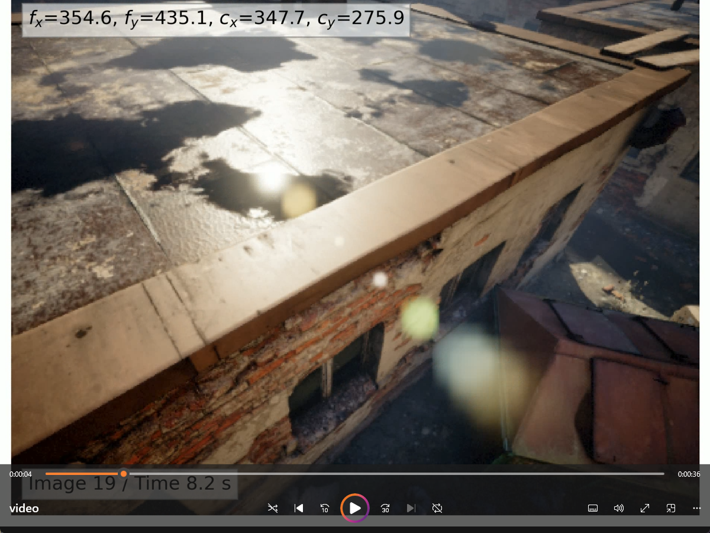
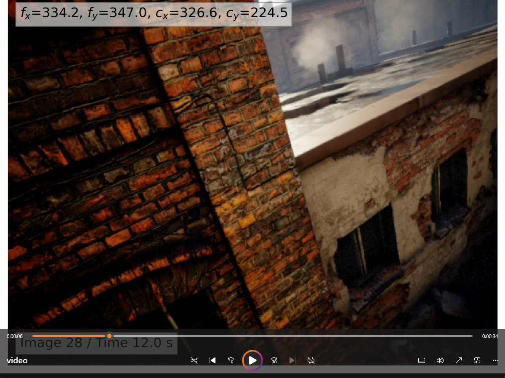
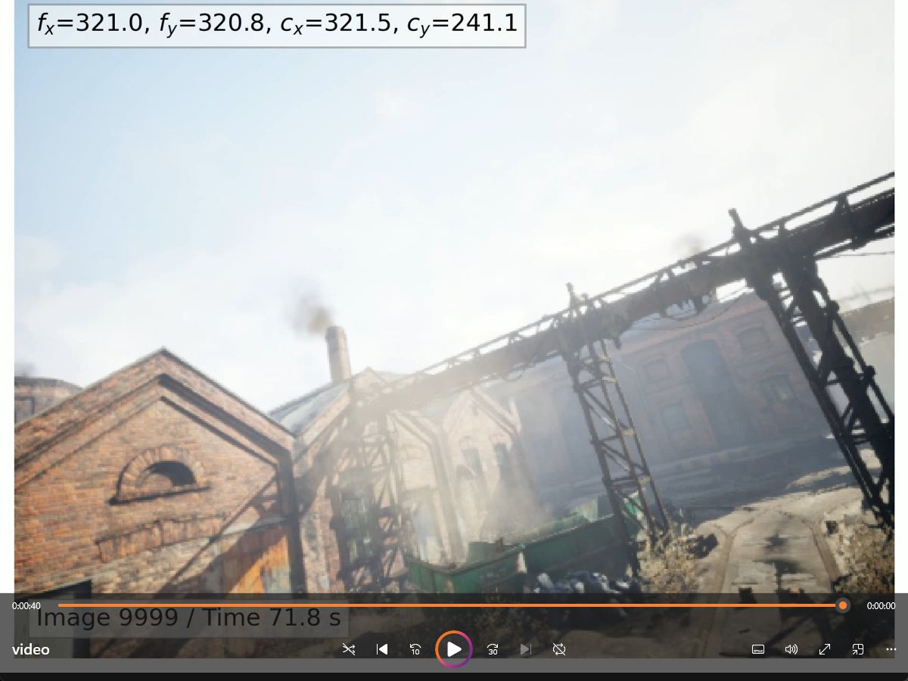

1 引言
---

### **研究问题 (Problem)**

精确的相机内参对于3D感知任务至关重要，但传统的标定方法严重依赖特定的标定物（如棋盘格），过程耗时且无法持续重新标定。现有的自标定方法也存在各自的局限性：

1. **经典多视图方法 (Classical SfM)**：虽然泛化能力强，但通常依赖手工特征，未能充分利用学习特征的强大能力。
2. **纯深度学习方法**：这类方法要么需要为每一个相机单独训练一个模型，要么直接从图像回归内参，但后者的精度被证明有限，并且需要一个包含各种相机的大规模均衡数据集才能实现良好泛化。

因此，核心挑战在于：如何设计一个既能利用深度学习强大的特征提取能力，又能摆脱对特定相机的依赖，实现对未知相机和环境高精度、高效率自标定的方法。

### **解决方案 (Innovation)**

为了解决上述问题，**DroidCalib 提出了一种新颖的深度几何感知相机自标定方法**，其核心是将经典的多视图几何约束与深度学习框架有机结合。

这个方法的主要创新点是引入了一个 **`自标定光束法平差层 (Self-Calibrating Bundle Adjustment Layer, SC-BA layer)`**。

* **解耦学习与几何**：该方法不像其他端到端网络那样尝试去“学习”相机投影的几何原理。它使用深度神经网络（继承自DROID-SLAM）来完成其最擅长的工作：从图像中提取特征并预测像素级的对应关系（光流）和置信度。
* **显式的几何优化**：它将相机内参、相机位姿和场景深度这些几何变量，通过一个可微分的 `SC-BA layer` 进行联合优化。这一层通过经典的、基于重投影误差的高斯-牛顿法来迭代求解最佳的内参，使得优化过程有坚实的几何理论基础。
* **模型泛化能力**：由于投影函数和多视图几何被显式地建模，模型不与任何特定的相机（如针孔或鱼眼）绑定，更换相机模型只需要调整 `SC-BA layer` 中的雅可比矩阵，而不需要重新训练整个深度网络。

通过这种方式，DroidCalib 成功地将深度学习的感知能力与经典BA的几何优化精度结合起来，实现了在未知环境下对单目视频进行高精度的在线自标定。

---
2 论文
---
## 2.1 输入与特征提取

系统接收一段单目图像序列（即一个按时间排序的图像序列）作为输入，并使用卷积神经网络（CNN）将每一帧图像转换为包含高级视觉信息的、尺寸为原始1/8的稠密特征图。

该图像序列被记为：$I = \{I_i\}_{i=0}^{N-1}$
* `N` 是序列中图像的总帧数。
* `I_i` 代表序列中的第 `i` 帧图像。
* 每一帧原始图像，都具有其原始的高度 `H0` 和宽度 `W0`。

#### 初始状态
在处理开始时，系统会对所有需要求解的变量进行一个**初始猜测**，这些变量包括：
* **相机位姿 $G_0^s$**：每一帧相机的位置和姿态。
* **场景深度 $z_0^s$**：每一帧图像中每个像素对应的三维点深度。
* **相机内参 $\theta_0^s$**：定义相机投影模型的核心参数，这是本论文最终要求解的目标。
##### ① 相机位姿初始化
* **文件**: `droid_slam/depth_video.py`
```python
class DepthVideo:
    def __init__(self, N, dim, opt_intr=True, camera_model="pinhole"):
        # 初始化相机位姿 (7参数表示SE3李群)
        self.poses = torch.zeros(N, 7).cuda()  # G0 - 初始位姿
        # 第一个位姿设为单位矩阵
        self.poses[0, 3] = 1.0  # 单位四元数实部
```
##### ② 场景深度初始化
* **文件**: droid_slam/depth_video.py

```python
class DepthVideo:
    def __init__(self, N, dim, opt_intr=True, camera_model="pinhole"):
        # 初始化场景深度 (视差图)
        self.disps = torch.ones(N, *dim).cuda()  # z0 - 初始深度
        # 传感器深度数据（如果有）
        self.disps_sens = torch.zeros(N, *dim).cuda()
```
##### ③相机内参初始化
* **文件**: droid_slam/depth_video.py

```python
class DepthVideo:
    def __init__(self, N, dim, opt_intr=True, camera_model="pinhole"):
        # 初始化相机内参
        self.intrinsics = torch.zeros(N, 4 if camera_model != "mei" else 5).cuda()  # θ0 - 初始内参
        # 所有帧共享相同内参
        self.intrinsics[:] = self.intrinsics[0].repeat(N, 1)
```

一旦接收到图像，系统不会直接在原始像素上操作，而是首先通过一个**卷积神经网络 (CNN)** 将每张图像转换为包含更丰富语义信息的**特征图 (feature map)**。

* **目的**：提取出对后续几何匹配和推理更有帮助的深层视觉特征，而不是简单的颜色或亮度值。
* **网络结构**：该过程由两个并行的卷积神经网络完成，这部分借鉴了其基础架构 DROID-SLAM 的设计：
    1.  **特征网络 (Feature Network)**：主要用于后续计算图像间的相关性。
    2.  **上下文网络 (Context Network)**：提取用于指导后续循环更新过程的上下文信息。
* **输入**：单张图像 $I_i$ (维度: $H0 \times W0 \times 3$)。
* **输出**：两组稠密的特征图。
* **维度**：经过CNN处理后，输出的特征图在空间维度上会被降采样。论文中明确指出，特征图的高度 H 和宽度 W 是原始图像的 1/8。因此，输出特征图的维度为 $(H0/8) \times (W0/8) \times D$，其中 D 是特征通道的数量（例如64或128）。


#### 图像对选择

值得注意的是：
选择图像的**基本单位是图像对**。整个系统的核心操作是针对成对的图像（在图中被标记为 `image_i` 和 `image_j`）进行的。这两张图像分别经过CNN处理后，就得到了用于比较的特征图。

* **选择标准是“视野重叠”**：论文中明确指出，系统输入的图像对 `(i,j)` 的选择标准是它们具有重叠的视场 (**overlapping field-of-view**)。

* **连续帧是常见情况**：在视频中，连续的两帧通常具有最高的视野重叠度，因此它们是最常被选为图像对进行处理的。

* **但是不限于连续帧**：
    1.  在**训练时**，模型会处理由七张图像组成的短序列，这意味着系统可以在这七张图像中形成多个不同的图像对。
    2.  在**实际的SLAM系统运行时**，它会动态构建一个连接所有视野重叠图像的“帧图”。这可能包括相邻的几帧，也可能是在相机回到一个之前经过的区域时（即“回环”），连接两个在时间上相距很远的帧。
    3.  论文的实验部分甚至提到，在处理某些数据集时，他们会“跳过每一帧的下一帧” (`skip every other frame`)，这明确说明了被处理的图像对不是连续的。

## 2.2 相关性计算

通过计算任意两帧图像特征图之间所有特征向量对的内积，构建一个概念上的4D“相关性体积”，它存储了所有像素对之间的视觉相似度分数，为后续匹配提供依据。

### 4D 相关性体积定义

4D 相关性体积是一个四维数据结构，它通过计算两张图像（例如，图像 i 和图像 j）特征图之间所有特征向量对的内积（dot product）来构建。

**构建方式**：通过取图像 i 的特征图和图像 j 的特征图中所有特征向量对的内积来计算。

**维度**：它的维度是 H×W×H×W，其中 H 和 W 分别是特征图的高度和宽度。

**含义**：体积中的每一个元素代表了图像 i 在某个坐标处的特征向量与图像 j 在另一个坐标处的特征向量之间的内积值。这个值可以衡量这两个区域的视觉相似度，高相关性（即内积值大）表明两个图像区域相似，因此它们很可能是对应的区域。

$$
C_{ij} \in \mathbb{R}^{H \times W \times H \times W}
$$

它的每一个元素都是通过特征向量的内积计算得到的。

* **维度**: $H \times W \times H \times W$
    * 前两个维度 ($H \times W$) 索引了 `image i` 特征图中的每一个像素位置 $(u_1, v_1)$。
    * 后两个维度 ($H \times W$) 索引了 `image j` 特征图中的每一个像素位置 $(u_2, v_2)$。
* **含义**: $C_{ij}$ 中坐标为 $(u_1, v_1, u_2, v_2)$ 的那个值，就代表了 `image i` 在 $(u_1, v_1)$ 位置的特征向量与 `image j` 在 $(u_2, v_2)$ 位置的特征向量的相似度分数。

### 按需计算 (On-demand Computation)

这个 4D 体积是极其巨大的。例如，对于降采样后 60×80 的特征图，这个体积的大小是 (60×80)×(60×80) = 4800×4800 ≈ 23,000,000 个浮点数。如果一次性把它全部计算出来并存储在 GPU 显存中，会立刻导致显存溢出。

因此，论文明确指出，系统并**不会预先计算完整的相关性体积**，在后续步骤中，当系统需要知道某个特定区域的相似度时，它才会通过一个**查找算子 (lookup operator L)** 去实时计算相关性体积中对应的那一小部分数值。

## 2.3 迭代更新-预测流动修正量

### 2.3.1 神经网络预测：从理论到修正

在每一次迭代（我们称之为第 k 次迭代）开始时，系统首先要回答一个问题：“如果我当前对内参 $\theta^{k-1}$、位姿 $G^{k-1}$ 和深度 $z^{k-1}$ 的估计是正确的，那么 `image i` 中的像素点 $u_i$ 应该出现在 `image j` 的哪个位置？”

这个问题的答案，就是**理论对应点 $\hat{u}_{ij}$**。

#### ① 计算理论对应点 (理论预测)

* **起点/输入**:
    * **上一次迭代的几何参数**: $(\theta^{k-1}, G^{k-1}, z^{k-1})$
        * **内参 $\theta^{k-1}$**: 一个低维向量，例如对于针孔相机，维度为4 $(f_x, f_y, c_x, c_y)$。
        * **位姿 $G^{k-1}$**: 一系列 SE(3) 矩阵，描述了每帧相机的位置和姿态。
        * **深度 $z^{k-1}$**: 一系列深度图，每张深度图的维度为 $H \times W$。

* **计算过程 (重投影)**: 利用输入的几何参数，通过纯粹的几何投影计算出理论上的像素对应位置 $\hat{u}_{ij}$。
    1.  **逆投影**: 利用内参 $\theta$ 和深度 $z_i$，将 `image i` 上的二维像素点 $u_i$ “还原”成在相机 `i` 坐标系下的三维空间点。
    2.  **坐标变换**: 利用当前的相对位姿 $G_{ij}$，将这个三维点从相机 `i` 的坐标系变换到相机 `j` 的坐标系。
    3.  **再投影**: 再次利用内参 $\theta$，将这个已经变换到相机 `j` 坐标系下的三维点，重新投影回 `image j` 的二维图像平面上，得到一个理论上的二维像素坐标。

* **计算公式**:
    $$
    \hat{u}_{ij} = \pi(G_{ij} \circ \pi^{-1}(u_i, z_i, \theta^{k-1}), \theta^{k-1})
    $$
    * `ui`: `image i` 的像素坐标网格，维度为 H×W×2。
    * `û_ij`: 计算出的 `image j` 上的理论对应点坐标，维度为 H×W×2。


#### ② ConvGRU 模块：进行视觉感知和推理

理论对应点 $\hat{u}_{ij}$ 仅仅是基于上一次几何估计的猜测。现在需要神经网络介入，根据真实的图像内容进行感知和推理，并产出用于优化的目标。

* **输入 (Inputs)**:
    * **相关性特征 (Correlation Features)**: 以理论对应点 $\hat{u}_{ij}$ 为“锚点”，查询第二步生成的4D相关性体积 $C_{ij}$，并结合上下文特征等信息，送入 ConvGRU 模块进行推理。
    * **上下文特征 (Context Features)**: 由一个单独的上下文网络提取的、包含更宏观场景信息的特征图。
    * **当前光流估计 (Current Flow Estimate)**: 由理论对应点 $\hat{u}_{ij}$ 减去原始点 $u_i$ 计算得出的理论像素位移。

* **输出 (Outputs)**:
    ConvGRU 模块处理完输入信息后，会先计算出一个更新后的内部“记忆”（即隐藏状态 $h_{ij}^{k+1}$）。然后，这个隐藏状态会被用来预测以下几个关键的输出：
    * **稠密流动修正量 (Dense Flow Revision, $\Delta u_{ij}$)**: 一个二维向量场，用于修正理论上的对应点位置。
    * **置信度权重 (Confidence Weights, $w_{ij}$)**: 一个权重场，代表了网络对它给出的每一个流动修正量的信心有多大。
    * **像素级阻尼因子 (Pixel-wise Damping Factor, $\lambda$)**: 通过对隐藏状态进行池化操作预测得出的一个参数，用于后续的优化过程。


### 2.3.2 几何优化：构建代价函数

神经网络完成了它的感知和预测任务，现在轮到几何优化部分接手，利用神经网络的输出来更新几何参数。

#### ① 计算测量对应点 (优化的"目标")

这是由**理论预测**和**网络修正**共同构成的、最终的对应点，它被认为是本次优化中应该努力靠近的“正确答案”或“目标真值”。

* **计算公式**:
    $$
    u_{ij}^* = \hat{u}_{ij} + \Delta u_{ij}
    $$
    * $\Delta u_{ij}$ 是 ConvGRU 预测出的流动修正量。
    * $u_{ij}^*$ 是一个稠密的坐标场，维度为 $H \times W \times 2$。

#### ② 构建代价函数 E (总误差)

优化的核心是构建一个代价函数（或总误差）`E`，它的值取决于三个变量：所有相机的位姿 `G`、场景的深度 `z`、以及相机的内参 `θ`。我们的目标就是通过调整这三个变量，来找到使 `E` 最小的值。

这个代价函数衡量的是 **“测量对应点 $u_{ij}^*$”** (目标) 和 **“理论预测 $\pi(...)$”** 之间的加权距离。

* **公式 (Eq. 4)**:
    $$
    E(G, z, \theta) = \sum_{(i,j) \in \mathcal{P}} || u_{ij}^* - \pi(G_{ij} \circ \pi^{-1}(u_i, z_i, \theta), \theta) ||^2_{\Sigma_{ij}}
    $$

* **公式解析**:
    * $u_{ij}^*$: 优化的“目标”，即神经网络预测出的“测量对应点”。
    * $\pi(...)$: 优化的“预测”，即当前几何参数 $(G, z, \theta)$ 推算出的“理论预测”。
    * $|| ... ||^2_{\Sigma_{ij}}$: 计算“目标”和“预测”这两个二维坐标点之间的**加权距离的平方**。
        * **下标 $\Sigma_{ij}$** 代表这个计算是**加权的**。权重来自于神经网络预测的**置信度权重 $w_{ij}$**。
        * 如果神经网络对某个点的预测很有信心 ($w_{ij}$ 很大)，那么这个点的误差在总误差 `E` 中的“惩罚”就越重，优化器会优先去减小这个误差。

该模型将 DROID-SLAM 原本的 DBA 层换成了 SC-BA 优化层，以 $u_{ij}^*$ 为目标，构建一个衡量理论投影与目标之间差距的加权最小二乘代价函数 `E`，并进行严格的数学计算，最终更新几何参数 $(\theta, G, z)$。

### 2.3.3 求解优化问题：通过高斯-牛顿算法求解让代价函数 E 最小的参数更新量。

* **公式 (6):**
    $$
    J^T W J \Delta\xi = J^T W r
    $$

* **维度:**
    * **$\Delta\xi$**: 我们要求解的**参数更新向量**，这是一个维度很长的一维向量，其总维度为 `(相机位姿变量数 × 6) + (内参数量) + (总深度点数量)`。它由以下部分拼接而成：
        $$
        \Delta\xi = (\Delta G, \Delta\theta, \Delta z)^T
        $$
    * **$J$**: 雅可比矩阵，一个巨大的稀疏矩阵。
    * **$r$**: 残差向量，由所有点的二维误差向量堆叠而成。

* **终点/输出:**
    优化站计算出更新量后，输出本次迭代的**最终结果**：
    * **更新后的内参**: $\theta^k = \theta^{k-1} + \Delta\theta$
    * **更新后的位姿**: $G^k = G^{k-1} \oplus \Delta G$ (在李群流形上进行更新)
    * **更新后的深度**: $z^k = z^{k-1} + \Delta z$

* **循环**: 这组更新后的参数 $(\theta^k, G^k, z^k)$ 将作为下一次迭代的起始输入，再次进入流水线的第一站。这个过程不断循环，直至收敛。

SC-BA优化层的目标，就是不断调整相机内参($\theta$)、位姿(G)和场景深度(z)，使得根据这些参数通过几何原理计算出的理论投影点，能够与神经网络给出的、带有高质量置信度的目标对应点 $u_{ij}^*$ 尽可能地重合。所有点的加权误差之和 E 越小，就说明我们估计的这一整套参数越精确。


## 2.4 训练与损失函数

在训练阶段，系统会计算最终估计内参与真实内参之间的损失。由于整个流程（包括SC-BA层）是完全可微分的，这个损失可以反向传播来更新神经网络的参数，从而“教会”网络如何预测出最有利于几何求解的对应关系。

DroidCalib 的设计精髓就在于，从输入图像到最终输出内参的**整个流程都是可微分的 (differentiable)**。这意味着，即使是 SC-BA 层这样复杂的几何优化过程，也被设计成了在数学上可以求导的模块。

在DROID-SLAM中，有如下：
1. 测地线损失 (Geodesic Loss)
2. 残差损失 (Residual Loss)
3. 光流损失 (Flow Loss)

这些损失函数主要用于系统的训练阶段，帮助神经网络学习更好的特征表示和运动估计，而不是在实际SLAM运行时使用。在运行时，系统使用的是Bundle Adjustment优化（公式6-10），直接最小化重投影误差。

**在Droid-calib中，额外添加了内参损失函数**

### 2.4.1 内参损失函数 ($L_{\theta}$)

* **输入**:
    * 每一次迭代中 SC-BA 层输出的内参估计值: $\hat{\theta}^k$
    * 数据集中提供的真实内参 (Ground Truth): $\bar{\theta}$

* **核心公式**:
    论文中明确给出了额外添加的内参损失的计算公式：
    $$
    L_{\theta} = \sum_{k=1}^{n_k} \gamma^{n_k-k} ||\hat{\theta}^k - \bar{\theta}||_1
    $$

* **公式含义与维度分解**:
    * **$L_{\theta}$**: 最终计算出的**内参损失值**。这是一个**1维的标量**，代表了本次预测的总误差。
    * **$\sum_{k=1}^{n_k}$**: 对**每一次迭代**的结果都计算一次损失，然后累加。这意味着在一次7帧序列的处理中（共14次迭代），网络会收到14次关于其表现的“反馈”，这是一种非常密集的监督方式。
    * **$\hat{\theta}^k$ 和 $\bar{\theta}$**: 分别是第 `k` 次迭代的估计内参与真实内参。它们都是低维向量（例如4维），所以 $||\cdot||_1$ 计算的是它们之间的**L1范数**（各项绝对差之和），结果是一个1维的标量。
    * **$\gamma^{n_k-k}$**: **权重因子**。$\gamma$ 是一个小于1的常数（如0.9）。这个项的巧妙之处在于，随着迭代次数 `k` 的增加（越来越接近最终结果），指数 $n_k-k$ 会变小，导致整个权重项变大。这意味着，**系统更关心后期迭代的准确性**，因为后期的估计是基于更充分优化的结果，理应更接近真值。

### 2.4.2 学习过程：反向传播

1.  在一次前向传播（即完整执行一遍第一到第三步）后，系统计算出总的损失值（包括 $L_{\theta}$ 和其他损失）。
2.  然后，这个损失值的梯度会沿着整个计算图**反向传播**。
3.  梯度会一直传到流水线的起点——**神经网络**，并告诉网络中的每一个参数（权重）应该如何微调，才能在下一次看到类似输入时，做出能产生更小损失的预测。


### 2.4.3 **核心逻辑**

这部分的核心逻辑是解释**系统如何通过一个精心设计的损失函数，将最终的几何精度误差反向传递，从而“教会”前端的神经网络如何更好地预测对应关系**。

1.  **前提：端到端可微分**：整个 DroidCalib 的流程，从输入图像到最终输出内参，虽然包含了复杂的几何优化（SC-BA层），但从数学上被设计成一个完全可微分的模块。这是实现端到端训练的基础。
2.  **计算内参损失**：在一次完整的前向传播（包含多次内部迭代）后，系统会计算一个**内参损失值 ($L_{\theta}$)**。这个损失函数会比较**每一次迭代**输出的内参 $\hat{\theta}^k$ 和数据集提供的真实内参 $\bar{\theta}$ 之间的L1距离。
3.  **加权反馈机制**：该损失函数有一个关键的权重因子 $\gamma^{n_k-k}$。它会让**越靠后的迭代**产生的误差在总损失中占据**越大的比重**。这是因为后期的估计是基于更充分优化的结果，理论上应该更接近真值，所以系统更关心后期估计的准确性。
4.  **反向传播与学习**：计算出的总损失值的梯度会沿着整个计算图**反向传播**，一直传到流水线的起点——**神经网络**。这个梯度会指导网络中的每一个参数（权重）进行微调，让网络在下一次处理类似输入时，能够产生更高质量的预测（光流修正和置信度），从而使得SC-BA层能计算出更精确的内参，最终降低损失值。

## 2.5 输出

在推理阶段（即模型训练完成后），系统执行前面的流程。当迭代循环结束后，系统最终输出三份结果：精确的相机内参、准确的相机轨迹（位姿）(可选)以及稠密的三维场景地图（深度）(可选)。

### 核心目标

* 在不依赖任何标定物和相机先验知识的情况下，从一段普通的单目视频中，**精确地恢复出相机自身的内参**，并能泛化到不同的相机模型（如鱼眼镜头）。

### 输入 (Inputs)

#### 1. 主要输入：

* 一段单目视频（即一个按时间排序的图像序列）。

#### 2. 初始状态 (Initial Guess)：

* 对所有待求解参数的一个**初始猜测值**，即使这个猜测非常粗略或不准确。这包括：
    * 相机内参 ($\theta^0$)
    * 相机位姿 ($G^0$)
    * 场景深度 ($z^0$)


系统在一个统一的优化框架下，同时求解以下三组核心参数：

1.  **相机内参 ($\theta$)**: 这是系统的**核心求解目标**，可能包括：
    * 焦距 ($f_x, f_y$)
    * 主点坐标 ($c_x, c_y$)
    * 畸变参数 (例如统一相机模型中的 $\alpha$)
2.  **相机位姿 ($G$)**: 描述相机在每一帧的空间位置和姿态（即相机轨迹）。
3.  **场景深度 ($z$)**: 描述场景的三维结构，通常以稠密深度图的形式存在。

### 最终输出 (Final Outputs)

当系统处理完视频并完成所有迭代循环后，最终输出以下结果：

1.  相机内参 ($\hat{\theta}$)。
2.  相机轨迹 ($\hat{G}$) (可选)。
3.  深度 ($\hat{z}$) (可选)。
---
项目代码
---
**源码链接**：https://github.com/boschresearch/DroidCalib

## 3.1创建环境
```python
conda create -n droidenv python=3.10 -y
conda activate droidenv
```
```python
conda env create -f environment_novis.yaml #安装环境包
```
```python
pip install torch==2.1.0+cu118 \
            torchvision==0.16.1+cu118 \
            torchaudio==2.1.1+cu118 \
            --index-url https://download.pytorch.org/whl/cu118 #安装正确版本的pytorch
```
安装PyTorch Geometric (PyG)
```python 
pip install torch-scatter -f https://data.pyg.org/whl/torch-2.1.0+cu118.html
pip install torch-sparse -f https://data.pyg.org/whl/torch-2.1.0+cu118.html
pip install torch-cluster -f https://data.pyg.org/whl/torch-2.1.0+cu118.html
pip install torch-spline-conv -f https://data.pyg.org/whl/torch-2.1.0+cu118.html
pip install torch-geometric -f https://data.pyg.org/whl/torch-2.1.0+cu118.html
```
```python 
python setup.py install #执行安装程序
```
```python 
python demo.py --imagedir=datasets/demo/abandonedfactory --opt_intr --num_images=300 #进行测试
```

## 3.2 测试结果

```python 
150it [00:58,  2.55it/s]
################################
Global BA Iteration #1
Global BA Iteration #2
Global BA Iteration #3
Global BA Iteration #4
Global BA Iteration #5
Global BA Iteration #6
Global BA Iteration #7
################################
Global BA Iteration #1
Global BA Iteration #2
Global BA Iteration #3
Global BA Iteration #4
Global BA Iteration #5
Global BA Iteration #6
Global BA Iteration #7
Global BA Iteration #8
Global BA Iteration #9
Global BA Iteration #10
Global BA Iteration #11
Global BA Iteration #12
################################
Initial intrinsics:
fx = 560.0, fy = 560.0, ppx = 320.0, ppy = 240.0
Estimated intrinsics:
fx = 321.03, fy = 320.83, ppx = 321.50, ppy = 241.05
```

初始内参 (Initial intrinsics):
```python 
fx = 560.0, fy = 560.0, ppx = 320.0, ppy = 240.0
```
这是一个非常粗略的初始猜测值。如果没有提供标定文件，默认的内部参数计算为：
```python 
fx = fy = (w0 + h0) / 2
cx = w0 / 2  #ppx
cy = h0 / 2  #ppy
```
估算内参 (Estimated intrinsics):
```python 
fx = 321.03, fy = 320.83, ppx = 321.50, ppy = 241.05
```
这是经过前面所有处理和两轮全局BA优化后，系统最终得出的精确结果。

如图 经过单目图片序列不断优化处理，系统最终得到精确的内参。


## 3.3 论文公式对应代码
$$
\pi(\mathbf{x}, \theta) = \begin{bmatrix} f_x \frac{x}{z} + c_x \\ f_y \frac{y}{z} + c_y \end{bmatrix}, \quad \pi^{-1}(\mathbf{u}, z, \theta) = z \begin{bmatrix} \frac{p_x - c_x}{f_x} \\ \frac{p_y - c_y}{f_y} \\ 1 \end{bmatrix} \quad (1)
$$
在 `droid_slam/geom/projective_ops.py` 中 101-128行的`proj`函数已经实现了正向投影和反向投影（python版本）。

### 正向投影（👈）代码实现

```python
def proj(Xs, intrinsics, jacobian=False, return_depth=False):
    
    # 从内参张量 intrinsics (对应论文公式中的 θ) 中提取焦距 (fx, fy) 和主点 (cx, cy)。
    fx, fy, cx, cy = extract_intrinsics(intrinsics)

    # 从输入的 M 维点张量 Xs (对应论文公式中的三维点 x) 中分解出 X, Y, Z 坐标和齐次坐标 d (通常为1)。
    X, Y, Z, d = Xs.unbind(dim=-1)

    # 这是一个数值稳定性保护措施。如果深度 Z 过小，为避免除以一个极小的数导致计算错误，
    # 将小于 0.5*MIN_DEPTH 的 Z 值替换为 1.0
    Z = torch.where(Z < 0.5*MIN_DEPTH, torch.ones_like(Z), Z)
    # 计算逆深度 d = 1 / Z。这是一个常见的计算技巧，将后续的除法操作转换为乘法，可以提高效率。
    d = 1.0 / Z

    # 计算 x 像素坐标，对应公式的第一行: fx * (X / Z) + cx
    x = fx * (X * d) + cx
    # 计算 y 像素坐标，对应公式的第二行: fy * (Y / Z) + cy
    y = fy * (Y * d) + cy

    # 根据参数决定是否在返回的坐标中额外包含深度信息。
    if return_depth:
        # 如果需要，将 x, y 和投影后的逆深度 d (D*d) 堆叠起来作为输出。
        coords = torch.stack([x, y, D*d], dim=-1)
    else:
        # 默认情况下，只堆叠二维像素坐标 (x, y)。
        coords = torch.stack([x, y], dim=-1)
    
    # 如果 jacobian 参数为 True, 则计算投影函数对于输入三维点坐标 (X, Y, Z, D) 的偏导数矩阵。
    # 这个矩阵在基于优化的方法（如高斯-牛顿法）中是必需的。
    if jacobian:
        # 获取输入的维度信息。
        B, N, H, W = d.shape
        # 创建一个与 d 形状相同的零张量，用于填充雅可比矩阵中的零项。
        o = torch.zeros_like(d)

        # 构建雅可比矩阵。矩阵的每一项都是投影坐标 (x, y) 对输入 (X, Y, Z, D) 的偏导数。
        # 导数计算如下:
        # ∂x/∂X = fx*d
        # ∂x/∂Z = -fx*X*d*d
        # 其他偏导数项 (如 ∂x/∂Y, ∂y/∂X 等) 均为 0。
        proj_jac = torch.stack([
            fx*d,    o, -fx*X*d*d, o,
               o, fy*d, -fy*Y*d*d, o,
        ], dim=-1).view(B, N, H, W, 2, 4)

        # 返回投影坐标和计算出的雅可比矩阵。
        return coords, proj_jac
        
    # 如果不需要雅可比矩阵，则第二个返回值为 None。
    return coords, None
```

### 反向投影（👉）代码实现
在 droid_slam/geom/projective_ops.py 文件中，iproj 函数实现了反向投影：（25-99）
```python
def iproj(disps, intrinsics, jacobian=False):
    # 获取视差图的高度和宽度
    ht, wd = disps.shape[2:]
    
    # 提取相机内参：fx(焦距x), fy(焦距y), cx(主点x), cy(主点y)
    fx, fy, cx, cy = extract_intrinsics(intrinsics)
    
    # 创建像素坐标网格
    # y: 垂直方向坐标，从0到ht-1
    # x: 水平方向坐标，从0到wd-1
    y, x = torch.meshgrid(
        torch.arange(ht).to(disps.device).float(),
        torch.arange(wd).to(disps.device).float())

    # 创建齐次坐标的第三分量，初始化为1
    # 在齐次坐标中，(x, y, 1)表示图像平面上的点
    i = torch.ones_like(disps)
    
    # 执行反向投影计算：
    # 1. 将像素坐标转换为中心化坐标: (x-cx), (y-cy)
    # 2. 除以焦距进行归一化: (x-cx)/fx, (y-cy)/fy
    # 这样得到的是在归一化相机坐标系中，深度为1时的3D点坐标
    X = (x - cx) / fx  # 归一化X坐标
    Y = (y - cy) / fy  # 归一化Y坐标
    
    # 将X, Y, Z(=1), 以及原始视差值组合成4维点坐标
    # pts的形状为 [B, N, H, W, 4]
    pts = torch.stack([X, Y, i, disps], dim=-1)

    # 如果需要计算雅可比矩阵（用于优化过程中的梯度计算）
    if jacobian:
        # 初始化雅可比矩阵，与pts形状相同
        J = torch.zeros_like(pts)
        # 对于视差分量，其导数为1（因为输出直接等于输入）
        J[...,-1] = 1.0
        return pts, J

    # 返回3D点坐标和空的雅可比矩阵
    return pts, None

```

